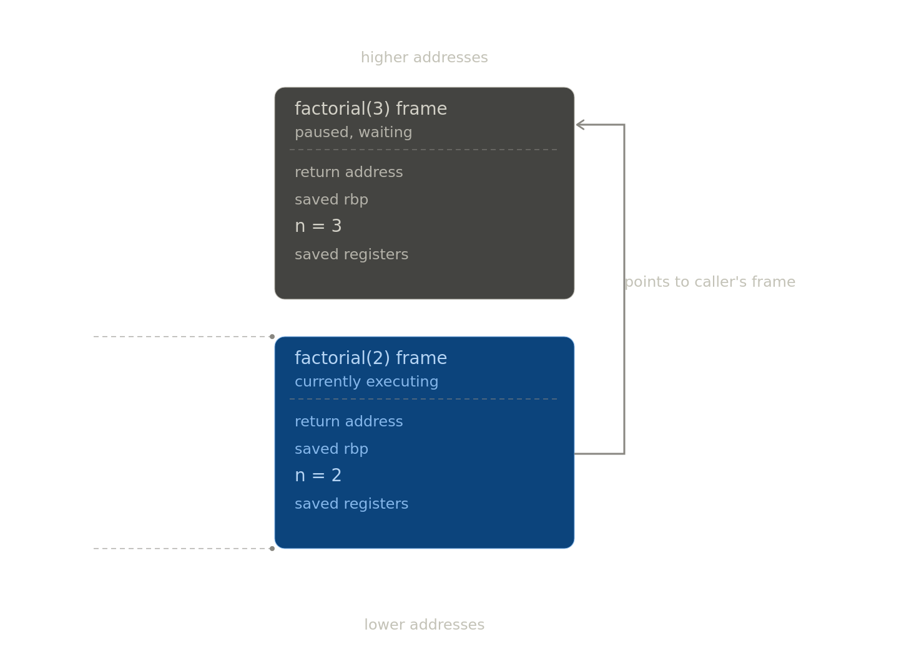

# Recursion - A Deep and Technical Dive

## Visualize

```py
def factorial(number: int) -> int:
  if number == 0:
    return 1
  return n * factorial(number=(number - 1))
```

Imagine we wants to calculate factorial of 4:

1. The runtime pushes a new stack frame.
2. `n` is not 0, so the line 4 needs the result of factorial 3 before this frame can
   finish. A new frames is pushed, and this one only waits.
3. Same thing for factorial of 2 and 1.
4. Pushes a frame for factorial 0. This is the base case, and this frame will return 1
   immediately with not further calls.
5. `factorial(1)` returns 1. The frame is popped ant that memory is reclaimed.
   `factorial(1)` resumes with the returned value.
6. This will go up until we reach the `factorial(4)` call frame, and the last frame
   pops, making the call stack empty. That's it, the final return value is ready and our
   job is done.

## Stack Frame

Every function, recursive or not, allocates an activation record on the call stack.
Concretely speaking, when `factorial(3)` calls `factorial(2)`, the runtime pushes a
block of memory containing:

- **Return address**: Where to jump back to when this call is finished. It is pushed
  automatically by the `call` instruction.
- **Saved frame pointer**: The caller's base pointer, so it can be restored on return.
- **Parameters**: `n=4`, copied by value.
- **Local variables**: Anything declared inside the invocation.



## Call Stack

A call stack is a fundamental runtime memory structure used by programs to track the
execution of active functions or subroutines.

The stack is a fixed-size region of memory (often 1-8 MB per thread on Linux and Python,
caps you around 1000 frames by default via `sys.getrecursionlimit()`). Run out, and you
get a stack overflow error.

## Linear Stack Depth vs Total Work

Factorial is linear recursion, one call per frame, so the stack depth is O(n). On the
other hand, sth like naive fibonacci, each frame spawns two more before it can returns.
Yes, the stack depth is still only O(n) at any moment, but the total number of calls
made across the whole run is O(2^n). The stack survives fine, but the CPU melts. This is
why we have memoization.

## Tail Recursion

A recursive method is called tail-recursive when the recursive call is the last thing
executed by that method, otherwise it is known as head-recursive.

**What are the benefits of writing tail-recursive functions?** Tail-recursive methods
are optimized by some compilers (rust, c, c++). In case of tail-recursive methods, there
is no need to store the call frames of previous calls in the call stack, because there
is nothing left to do with the method and we won't return anything back to the parent.
This is called **tail-call optimization**. This would make the space complexity reduce
from O(n) (typically) to O(1).

> 🐍 This is not supported in Python.
