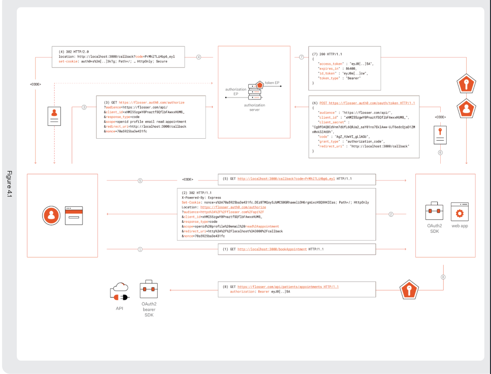
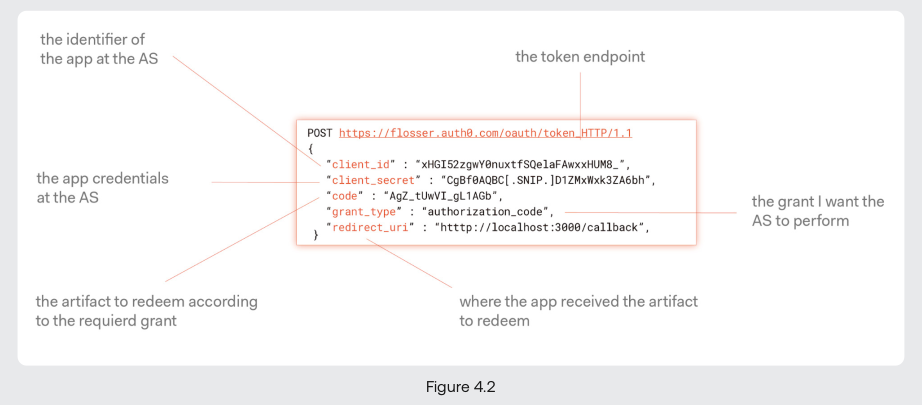
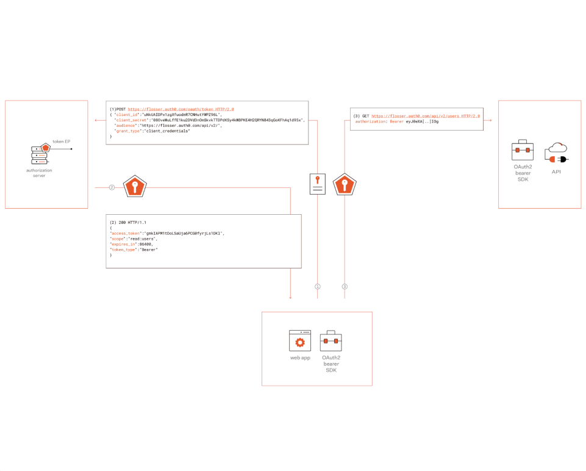
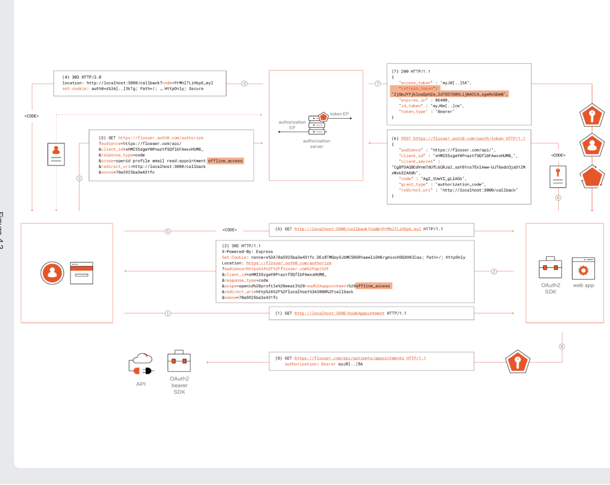
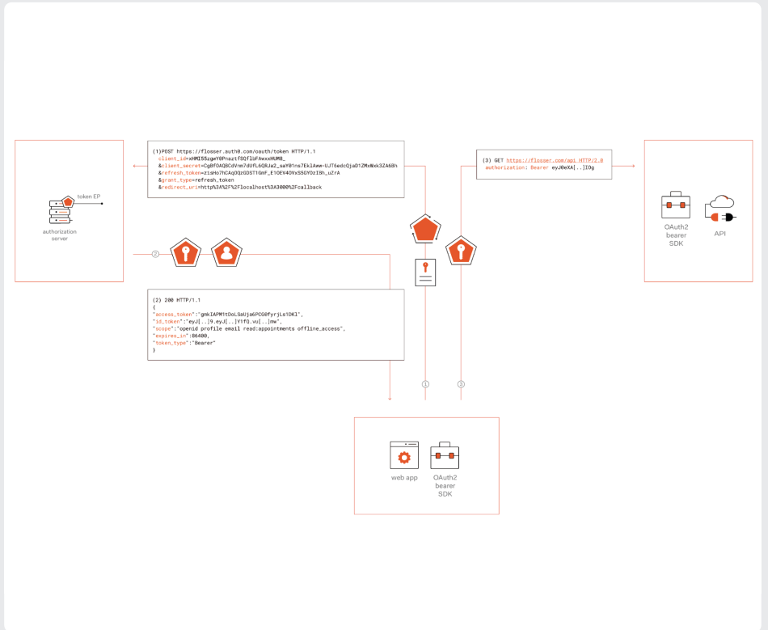
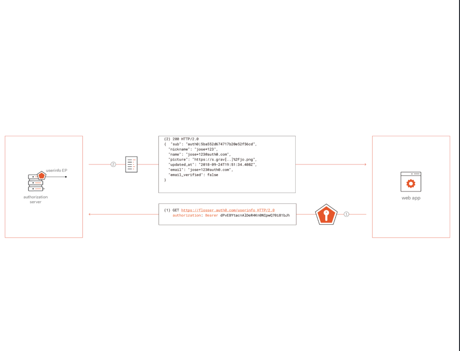

# Calling an API from a Web App

Most of the chapter will cover the quintessential and canonical use case of the oauth
2.0 framework: delegate access to third-party APIs. We won't talk much about signing-in
in this chapter

## The Authorization Code Grant

This is the main flow oauth 2.0 is created for. It enables client delegated and
restricted access to some resources, on behalf of the user within the boundaries of what
the user has consented for.

1. The application encounter a situation where it needs the user delegated access to a
   third-party API.
2. A 302 http response with a message to authorization server is delivered.
   - There is a `audience` query param, additional to what we see in the implicit flow.
     I am explaining it in the next part.
3. The browser execute the 302 HTTP redirection and call the authorization endpoint.
4. The authorization server do what it is necessary to authenticate the user, and set
   the session/cookie. Then it return its response to the callback endpoint of the
   client with an auth code.
5. The browser executes the redirect and that will dispatch the authorization code to
   the web application. From the moment, all the other operations happen in the server
   side.
6. The client combines the authorization code with its client credentials and call the
   the token endpoint.
7. The access token is granted and returned to the client. Here is the breakdown of the
   response:
   - The request access token.
   - An ID token in the response of the openid scope.
   - The expires_in parameter. This is send because the access token should be
     considered an opaque token by the client.
8. Use the access token to call an API.

> The `redirect_uri` in the token endpoint call body is for preventing an attacker
> performing URI replacement(How?).

Put the token in the `Authorization` header, unless you have a reasonable consideration
for not doing it.

### audience/resource

When you request an access token for an endpoint protected by Auth0, you need to specify
a parameter named `audience`. This param indicates the identity of the resource to which
the client is requesting on.

At first, Oauth 2.0 had this assumption that the resource server and authorization
server are co-located. This assumption makes it unnecessary for the existence of such a
parameter like the `audience`.

But when the solution includes a third-party authorization server, like the case the
customer leveraging the auth0 authorization server, the topology allows the same auth
server to gate access for multiple resources.

After all, the Oauth 2.0 group decided to set a standard for it, introducing the
`resource` parameter.

> The client should use the access token as an opaque token and it is a good practice to
> not rely on the information packed in the access token. Request an ID token for
> retrieving information about the user. Also, this is because the content of the access
> token should be private to the authorization server and resource server.

## Authorization Code Grant and PKCE

The latest Oauth 2.0 best practices suggests that every authorization code flow could
leverage PKCE(Proof Key for Code Exchange), an extension to the authorization code
grant, preventing code being stolen in transit.

I'll cover this topic in the next chapter.

## Authorization Concepts and Terminology

After all, Oauth 2.0 is an authorization framework, so it is worth learning and checking
some authorization concepts. Also, it is worth mentioning that some people misuse the
framework for more general authorization scenarios, the scenarios that the Oauth 2.0
does not come with. Don't be like that guys.

### Permissions

Permissions are just statements describing the type of operations that can be done on
particular resources. For example: blog:read and printer:bw. Permissions describe
intrinsic properties of a resource, which exists regardless of how the resource is
exposed.

They exist out of the Oauth 2.0 concepts, but you can use them inside the Oauth 2.0 too.

### Privileges

A privilege is an assigned permission: say Ali can read blogs on the website. So it is
certain operations a principal can perform on a particular resource.

### Scopes

The scope is the primitive which enables the client application to request a user's
permission for a particular permission for a given resource. A list of permissions are
asked to the authorization server as scopes. Also, scopes be used for other purposes(
like requesting an ID token).

### Effective Permissions

The effective permissions are the intersection of the privileges the resource owner has
and the scopes that are granted to the client. Client can't do anything outside of the
resource owner's permission.

The effective permissions represents what actually can the client do.

> Also, at anytime, the user's privileges can be restrained. Keep it in mind.

## Client Credentials Grant

Only confidential clients can use this grant, because they have to own their
programmatic identity. They should use their own identity rather than user's identity.
For other grants, the case was "borrowing some of the user's privileges while accessing
the resource server". This is not the case here. The case is that the confidential
client has its own identity and privileges on the resources itself.

I believe everything is clear and concise in the picture and it doesn't need further
explanation.

There are three ways that a confidential client could authenticate itself to the
authorization server:

- **client_secret_basic**: Handle the username and password to the auth server in the
  `Authorization` header, with the same approach as the basic authentication.
- **client_secret_post**: Send credentials through the request body.
- **client_secret_jwt/private_key_jwt**: The client itself signs a JWT assertion to
  prove its identity. This is the most secure and modern way.

You already know how to do the first two methods. I suggest to look at my
`oauth2-fastapi` repo for implementation details.

> There are no scopes in the client credentials flow. Oauth 2.0 hasn't specified a way
> to handle express permissions. You should use a custom solution.

## Refresh Token Grant

Why the tokens have expiration time? Because they contain some of the user's attributes,
and those attributes can change after the token issuance. Also, the ability of a client
to obtain a token at a time, doesn't necessarily means it can obtain another token
later.

So we want to retrieve the user's latest attributes, but we don't want our traffic
spikes. Also, it is beneficial if we don't give the tokens to the clients for a long
amount of time. The Oauth 2.0 comes up with a new grant and artifact, called
`refresh token`. Oauth 2.0 hasn't specified any specific ways and methods to handle it,
however, OpenID Connect specifies a mechanism to request refresh tokens.

Also, we don't to give our user's a bad experience, so the refresh token flow do the
operations without displaying prompts to the user.

Great, we can see two things have changed compare to the auth code flow. We have added a
new scope called `offline_access` in our request to the authorization endpoint, and the
authorization server will issue the client a refresh token, in the response of token
endpoint call.

> The `offline_access` scope is defined in the `OpenID Connect` core specification.

As you can see, everything is behind the scene and user won't notice anything. OK, maybe
she will notice something, but that doesn't bother us or the user.

The refresh token flow occur completely on the server side.

> Every request to the token endpoint should clarify the grant it is being used by the
> client.

You can use a method called `token rotation` when using the refresh token flow. This
ensures that every refresh token could only used once, and with every call to the token
endpoint with `refresh_token` grant type, another refresh token is issued. This might be
overkill for the confidential clients, but can be beneficial for the public clients,
triggering some security measures(e.g. revoking every access token issued for the
client).

Some considerations about the refresh token:

- The refresh token lifetime is decoupled from the user's session in the front-channel.
- Have this assumption that at any point, the refresh token or the access token may get
  invalid by the resource owner and authorization server. Implement appropriate error
  management and remediation logic upfront.

## Access Tokens vs ID Tokens

Ok, this was a confusing topic for me, let's dig deeper.

### Access Tokens Recap

Access tokens are artifacts to enable the clients to access a resource, typically on
behalf of a resource owner, bestowing the client application delegated access.

The client application should consider the token as opaque token and doesn't inspect it
and make logic based on the token claims and attributes. Inspecting token is the job of
resource server. Although, the client can use the token data for troubleshooting, but
after all, the change of the token shouldn't break the system.

Oauth 2.0 hasn't specified any token format, but there are several reasons why the JWT
format has been chosen and widely adapted these days.

### ID Tokens Recap

ID tokens are designed to support sign-in operations, and optionally, make
authentication information available to the clients. The clients must look into the ID
token, this is part of the validation we have talked about previous chapter.

ID tokens should not be used for calling APIs. Those are designed to handle sign-in
scenarios, and they are just for the user to get the confirmation of user authentication
and extracts the user attributes. There are several issues related to using ID tokens
for calling APIs:

- The API receiving the ID token can only verify that the token was issued for that
  particular client, there is nothing to say the token was issued for calling the
  particular API.
- The leaked ID token can not only used for accessing the client, but for calling an
  API.

#### ID Tokens and the Back Channel

The example from previous chapter was about how we could leverage the ID token and
OpenID Connect at the front channel, which is less secure.

The `Authorization Code Grant` we studied in this chapter can be used and is commonly
used for performing sign-in operations(by obtaining an ID token).

## The UserInfo Endpoint

For some reasons, the client may ask a simple ID token without any user claims(it might
be privacy-related, bandwidth-related, etc). OpenID Connect introduces a new endpoint
called `UserInfo Endpoint` which provides information about the user using a proper
access token.

In the first chapter we described that people abuses Oauth 2.0 for authentication
especially. We had three issues: access tokens could not be tied to a particular user,
could not be proven to have been issued as part of a sign-in operation for that app in
particular, and couldn't be standardized.

The UserInfo endpoint solves the first and third problems, but it doesn't replace the ID
token and it can not and should not do the ID token's job.

> Calling the UserInfo endpoint only proves that the corresponding access token is valid
> and associated with the user identity whose attributes are returned.

For calling the UserInfo endpoint you should obtain an access token for it. It is
reasonable for the token to be opaque, because the authorization server and the endpoint
are always co-located.

## Hybrid Grant

As the name suggest, combining two or multiple grants, result in an hybrid grant. A
common scenario is combining sign-in and API calling scenarios, meaning obtaining ID
token and access token both at the same time. It is beneficial for multiple reasons and
it got popular these days because of:

- Less network round trips.
- Efficient way performing sign-in operations and getting ready to invoke APIs at the
  same time.
