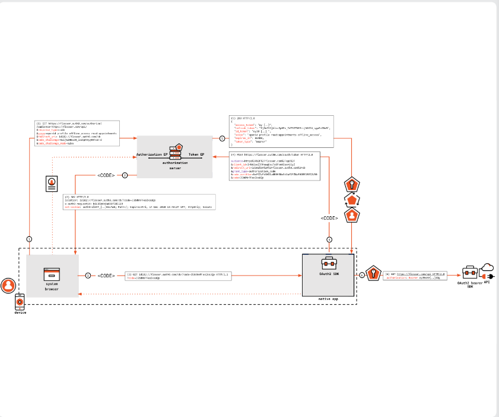
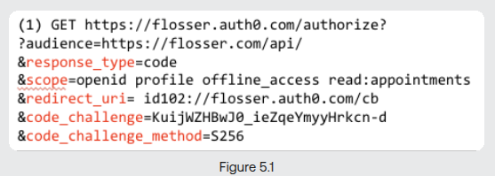
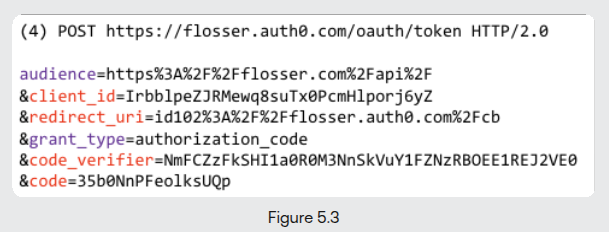
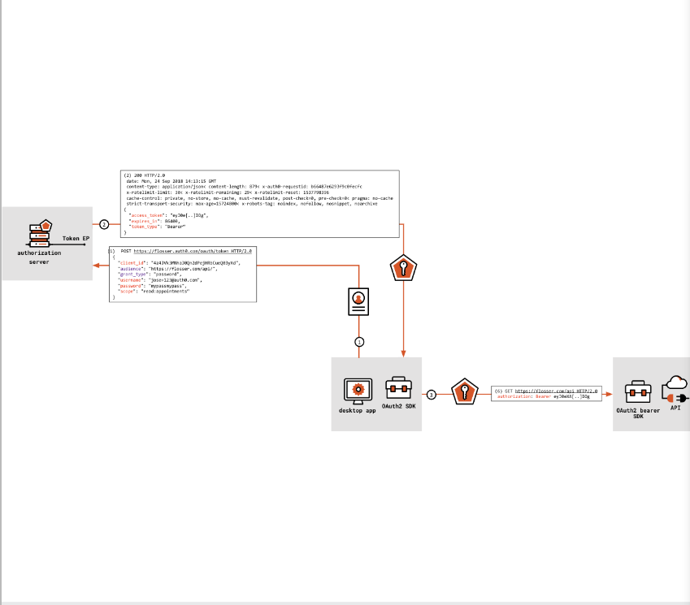

# Desktop and Mobile Apps

The main questions we are going to answer in this chapter is: How can we secure
applications meant to run on our desktops or mobile devices?

## Public Clients

The public clients are the opposite of confidential clients. They can not prove their
own identity, mainly because there is no way to secure the client credentials on the
locations the applications are installed.

## Native Applications and the Browser

The native applications should provide a little window for the user's authentication to
the authorization server, a surface capable of rendering HTML.

The best practice is to use the operating system's programmatic way to invoke the
system's browser from the native application. The issue here is, this solution adds a
little bit of attack surface, meaning every attacker trying to intercept the application
and browser communication, can stole tokens and codes, and use them. There are no client
credentials here, so stealing the token means full access to whatever the client was
intended to access.

> Don't do and trust embedded web views that native applications provide. Everything
> there is under control of the application itself, so basically it can steal your
> credentials. Also, the web view is out of the browser's context, so you may loose some
> valuable features of the browsers, leading to a worse user experience.

## Meet the PKCE

To prevent someone from intercepting the authorization code when it is moving from the
browser to my app, we can use PKCE. It introduces a mechanism which that substantially
ties the request of the code to a secret created by the app on the fly. The application
must demonstrate knowledge of that secret at code redemption time. As the result, anyone
that can steal the authorization code in transit, can not be able to use it unless they
provide that secret.

So when an application is using the system's browser, it should use this mechanism named
Proof Key Code of Exchange(PKCE). It is an extension to the authorization code flow.

So what a native application should essentially do is:

- Use the system's browser.
- Use PKCE for protecting the authorization code from other native applications.

## Authorization Code Flow with PKCE

Let's walk through the flow:

1. As you can see below, the authorization endpoint is called at first. We are not going
   to call an API on the resource server to then get redirected to the auth server and
   we are reaching the auth server directly in this scenario. The application uses the
   operating system's API to invoke the browser and call the endpoint.
   - The `redirect_uri` starts with the `id102` instead of `https`. It is a way to tell
     the operating system to invoke our app instead of the system's browser.
   - We have a `code_challenge` param, holding our secret.
   - We have a `code_challenge_method` just indicating how we constructed the
     `code_challenge`.
2. Nothing special, we can see the usual back and forth of auth server and our
   application.
3. The `id102` protocol sends the code to our application. Even if another app
   intercepts the code, it doesn't matter.
4. We now call the token endpoint:
   - The `redirect_uri` uses `id102` again.
   - The `code_verifier` is sent to show that we are the same guys requested the auth
     code at the first place.
5. We get the tokens as we specified in the `grant_type` and `scope`.
6. We call the resource server APIs.

> The refresh token artifact can be super beneficial for the application, because it can
> grant new access tokens without the burden of the authorization code flow with pkce.

### The Refresh Token Issues

The thing is, we doesn't have any secrets on the public clients, so the refresh token
grant and the request to the token endpoint is a little, um, not reliable? I can't find
the right adjective.

Two solutions have been introduced:

- **Token binding**: Set of specifications used to extend HTTPS stack and browser's
  ability to surface properties of HTTP stack that can be embedded in tokens. The
  solution was not supported much from Apple and eventually, Google, so yeah no one
  really use it anymore.
- **Mutual TLS Authentication**: A TLS layer authentication for the client, when the
  authorization server issues certificates for the client, and then every client request
  that does not provide those certificates would be rejected.

#### Application Level Demonstration of Proof of Possession(DPOP)

Oauth 2.0 introduced a new standard named `Demonstrating Proof of Possession`. It allows
clients to capable of generating non-extractable asymmetric keys to demonstrate their
proof of possession, which results in authorization servers bind tokens to them.

## Resource Owner Password Credentials Flow

This flow is deprecated in the Oauth 2.1 specification, here is why:

- It doesn't support the two initial reasons why the Oauth framework has invented. The
  user will share its password to the client, and there is no way for the user to limit
  what the client can do with its credential.
- No multi-factor authentication.
- You can't use multiple identity providers(e.g. Google, Apple).

Only scenario that you should consider using this flow, is where you're dealing with
legacy code and if the code already using it or using user's password in a way, and you
can not modify the code to use a more secure approach.

Anyway, the flow does worth a look:

Everything is clear and I don't see the need of further explanations here. I have
covered more complicated flows here.

## Other Grants for Native Applications

I am not covering these grants, but they deserve a mention:
`The Device Authorization Grant`, `The Token Exchange Grant`, and `The Extension Grant`.
