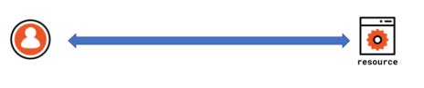
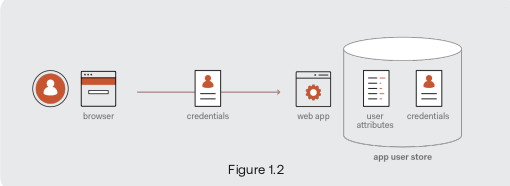
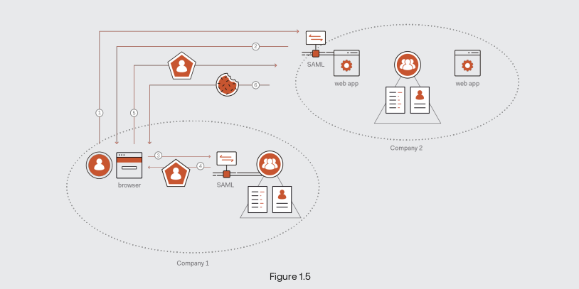
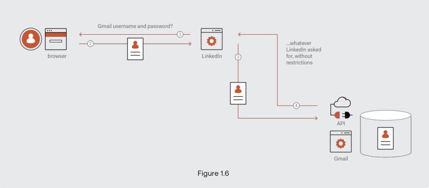
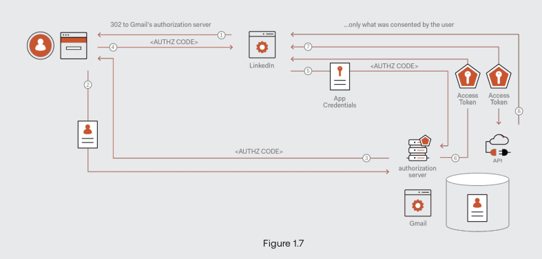

# Introduction to Digital Entity

The notes are written using the `Oauth 2.0 and OpenID Connect: The Professional Guide`
book by `auth0` institution.

The book and my notes should make you understand what is happening inside the oauth 2.0
and openID world. The book doesn't contain specific and detailed instructions on how to
use and implement the concepts, but it tries to make you understand why some small
details are in there and why we arrive at them, and how we arrive at them.

> Understanding the technical choices and the history behind things, will make you gain
> a professional knowledge of them. This is actually about finding out the `purpose` and
> `why`s from the critical thinking point of stand view.

Let's start. In this chapter, we are going to learn about concepts and jargons that are
essential to the identity world.

I have a resource and a user - an entity that wants to access that resource in some
capacity. So why accessing a resource by an entity becomes so complicated in the modern
era of software and security? Because a lot of things can go wrong here, and there are
the cartesian products of all these factors that come into play to determine what you
have to do to have a viable solution. Consider the following factors:

- Resource types: Previously there was a host and a central database. Now we have these
  buzz words like serverless, APIs, etc. These all point to different ways of exposing
  resources. When you are working with a computer, there is some kind of resources you
  are going to use and connect to.
- Development stack: Minor differences between development stacks that translates into
  big differences in the code you have to write to access the resources. For example,
  you would write a different code for connecting to an API using Python and C.
- Identities resources: You can have several ways to expose your identity online. You
  can be a member of social media application, or you can be an employee of a company.
  You connect to a facebook in different way you connect to an active directory. This
  adds up to the complexity. If you want to extract identity from these repositories,
  you have to find a way of doing it according to each repositories requirements.
- Client types: There are different clients for accessing resources nowadays. There are
  a lot of devices that can access resources, even our watches(smartwatches) can access
  data too! This adds up to the complexity.

> You have to use a service for the authentication and authorization, because of
> security reasons. Also, the services can abstract away the identity resources, offer
> multiple SDKs and libraries, and manage user life-cycle for you. Choose a customizable
> service.

## Open Standards

Open standards are wide agreements that have been crafted to offer common standards,
common protocols, common messages, and some common actions that should be done in the
transaction of the event. If these open standards were never made, some common actions
would be ambiguous for us now.

In identity management, I am going to touch with many protocols, but these are the most
common ones that are used nowadays:

- **OpenID Connect**: which is used for singing in.
- **Oauth 2.0**: which is the basics of openID and it is designed as an authorization
  framework to access third-party APIs.
- **JWT**: A standard token used in most of the authentication and authorization flows.
- **SAML**: Somewhat legacy(but still very much alive) protocol that is used for single
  sign-on across domains of browsers.

## Digital Identity and Its Evolution

By being exposed to a term in the right time of the history, you can understand the
concept behind it better. So, let's go through the digital identity and authentication
history and evolution, to understand them and their terms better.

We call **digital identity** the set of attributes that define a particular user in the
context of a function delivered by a particular application. What does it mean? It means
that if I am a student in university, my digital identity in the university application
is set of attributes such as my name, family name, my student id, how many lessons I
have passed, what are my scores, etc., etc. So what are my attributes in Reddit? Just a
username, that is probably fake. You see, there is no common attributes, despite me
being the same person. This shows that the digital identity relies heavily on the
context of the function delivered by the app.

> As a developer, when you are designing your user-related entities, you should pay
> attention to their attributes in the context of your application. In fact, you can use
> this for designing any entity in your system. The minimum set of attributes that are
> needed in the function of the specific task you are dealing with.

Now, a tricky question arise. How can I bring those attributes in to the context? There
is an old fashion answer for it: "Use something that the user and the resource agrees
on, such as a secret of some sort". So when the user come backs to site and demonstrates
knowledge of that secret, you say: "Ok, I know who you are". In summary, that means
grabbing a set of credentials, sending it over, and assume that you can verify the
credential. If the credentials are verified, the user is authenticated.

This is a simple scheme, and as such, it is very resilient. We have more advanced
technologies these days but still, the passwords are popular and they are not going
anywhere soon.

### Directories

A problem rise in the industry. A single person, having multiple user's entity in
different applications of the same organization. This makes unnecessary redundancy and
it would be a pain in the ass managing this redundancy, as like any other unnecessary
redundancies. So, industry responded with an entity named `directory`. It is a service
or a software component which centralizes functionalities related to authentication,
authorization, and user management.

The `directory` centralized credentials and attributes.

### Cross-Domain SSO

The previous solution is not scalable when you are dealing with more than one company.
The industry came up with a solution named `shadow accounts` which provisioned the user
to the resource side directly. This only makes the previous problems(before directories)
in scale.

Just like most of the solutions in the computer science industry, we created an
abstraction to solve this problem:). Some big guys sit around the table and came up with
a protocol named `SAML`, an acronym for Security Assertion Markup Language. In a
nutshell, the protocol describes a transaction which the user can sign in, in one place
and show proof in another place.

What are the roles here? We have an `Service Provider(SP)` which obviously provides some
services, and there is an `Identity Provider(IdP)` which vouch for who the user is.

Here, we should introduce another concept: `trust`. We say that a resource trusts an
identity provider or an authority when that resource is willing to believe what the
authority says about its users.

This is happen because of the elements of an impossible triangle, which is not
impossible at all:).

- **User convenience**: Log in once.
- **Security**: Don't share passwords.
- **Autonomy**: Each organization controls its own identities.

Let's look at how the SAML is working.

1. User will try to GET a page.
2. The middleware in front of the application notices that the user is not authenticated
   and redirects her to the identity provider.
3. The user is getting authenticated by identity provider.
4. The identity provider establishes the user authentication and issues a security
   token.
5. Once the identity provider issues a SAML token, it typically returns to the browser
   inside an html form with some javascript that triggers as soon as possible the page
   is loaded, POSTing the token to the application that will be intercepted by the
   middleware.
6. The middleware looks at the token and establishes it is coming from a trusted source
   and the signature is not broken. If everything was fine, it emits a session cookie.
   The session cookie represents the facts that the user is authenticated successfully
   and prevents this token dance every time user is interacting with the application.

#### Security Token

A security token is an artifact, a bunch of bits, used to carry tangible proofs that the
user is authenticated. They are digitally signed and contains claims about the user.

What does digitally signed means? A digital signature is something that protects bits
from tampering.

The attributes that are traveled inside the token are called `claims`. A claim is simply
an attribute packaged in a context that allows the recipient to decide whether to
believe that the user indeed possesses that attribute.

## Password Sharing Anti-Pattern

Imagine a scenario when you want to login to your reddit account using your github
account(can I?). In past days, this action involved reddit to get your github
credentials and use them to access github APIs for programmatic access to its own
servers. We are dealing with two problems here:

- Granting access to your credentials to an entity that is not the custodian of those
  credentials is always a bad idea.
- This way of implementation give too much access and power. In the above scenario,
  reddit could do literally everything with my github account, like issuing something
  inappropriate in one of the main repositories:)(It is not likely to happen but
  whatever)

Here is a diagram of a similar scenario, except gmail and linkedin replaced github and
reddit in our example.

The question that was answered by the SAML protocol was: "How can an enterprise assert
that the user is authenticated to another enterprise in a verifiable way?". SAML
introduced:

- **Assertions**: Signed statements.
- **Federation**: pre-established trust.
- **Browser-based redirection**: user carries the message.

## Oauth 2.0

OK, here we are, we reached to the oauth 2.0. Before starting I want to say that the
industry came up with the oauth 1.0 at first but due to some complications and
limitations of it, oauth 2.0 was created to solve the issues of password sharing,
specially too much power of the services using another service credentials.

The delegated access scenario was being able to implement, by introducing a new entity,
calling the **authorization server**. The authorization server has two endpoints:

- **authorization endpoint**: The endpoint designed to deal with the user granting
  specific access and permissions to the client. Also, this is the endpoint where user
  enters her username and password.
- **token endpoint**: The endpoint used by the client to grant something called an
  `access token`.

> The `authorization endpoint` is designed for end-user to work with, in contrast of
> `token endpoint` which is for software-to-software communication.

The diagram is demonstrating the canonical flow and use case of oauth 2.0.

1. The client will redirect the user to the authorization server and in particular, the
   authorization endpoint.
2. The user will authenticate herself in the authorization server.
3. Once the user authenticated herself and accepted the privileges that the client asked
   for, the authorization server emits an authorization code.
4. From now on, everything is going to happen on the server side.
5. The client will send its `client id`, `client secret`, and the `authorization code`
   saying "hey, I am the client and this user has granted access to me".
6. The authorization server will then send an `access token` for the client.
7. The client can call the APIs the other service containing the generated access token.
8. The client can access the other service data on behalf of the user, only within the
   the scope user consented to.

> An authorization code is just an opaque string that constitutes a reminder for the
> authorization server that the user has granted consent to those permission for that
> particular client.

### Client

The service that wants to use other service resources, should register itself as an
client, which will result in a `client id` and a `client secret`. These are the
credentials that the service can use to prove its identity when it is sending the
authorization code to the authorization server.

**Scope** is the keyword that we use to represent the permissions that is asked by the
client on behalf of the user.

This flow shows the canonical use case of oauth 2.0, not all of its use cases. Oauth 2.0
is abused in a lot of ways these days:).

## OpenID Connect, One of Places where Oauth 2.0 Get Abused

When the delegated authorization scenarios started gaining traction, many application
developers decided that they wanted to do more than just call APIs. They wanted it to
achieve in the consumer space what we achieved with SAML. They wanted to allow uses sign
in to their apps, reusing accounts living in a completely different system.

However, oauth 2.0 was not designed for sing-in operations. Some guys tried and are
still trying to use it for sign-in, but it can not handle it without some flavors.

The vulnerabilities of using oauth 2.0 as an authentication framework, lies in the fact
that a successful API call to the service that is holding the authorization server isn't
really gonna prove anything. Imagine a hacker injecting a token of another client to
your client, that other client was using the same authorization server you were using.
You will assume that everything is fine and will proceed forward. Maybe the hacker
inject his token to another user's request, and as you could anticipate it, the request
will succeed! These attacks are classified under the `Confused Deputy` attacks.

### What is the Layer on Top of the Oauth 2.0, Enabling Authentication?

A new specification called OpenID Connect is introduced to solve the problems we talked
about. It introduced a new artifact called `ID token`. It can be issued by the
authorization server along with the authorization code. It is kinda working like SAML,
where the server issues the ID token not for accessing resources by the client
delegating the user, but for the client itself to be consumed. The `ID token` has a
known format and it can validate it and extract identity information.
