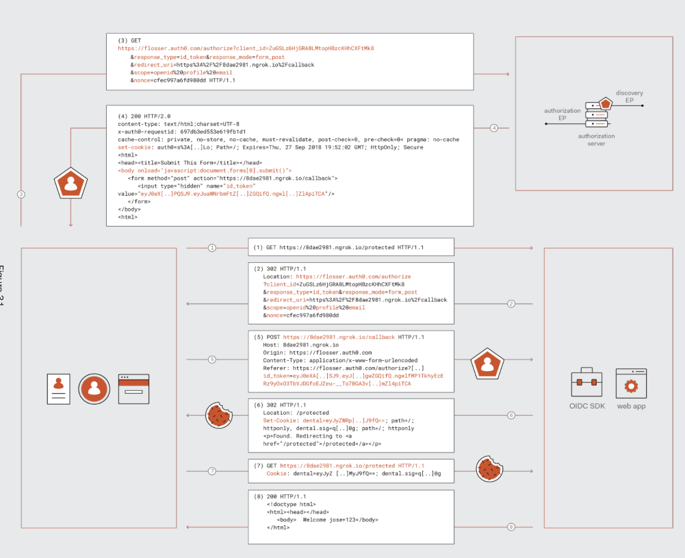
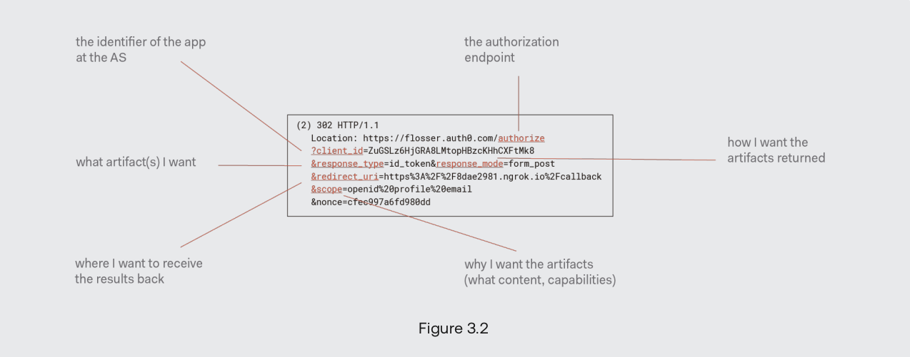

# Web Sign-in

**What is an artifact?** A tangible output produced during some kind of development
process. It could be test files, documentations, docker images, executable files, and in
the auth context, a token.

## Confidential Client

A confidential client is a client which can prove its own application programmatic
identity. It is any kind of application that the authorization server can assign
credentials for it and allows the app to prove its identity as a registered client,
during a request to the authorization server.

The singleton applications, typically running on a server(even as a cluster, but they
are a single entity) can contain those unique credentials and secrets, in contrast of
the native applications who has an instance on every operating systems they are
installed on.

> In summary, confidential clients are the clients that actually can hold and assign a
> secret too.

## Implicit Grant

The easiest way to achieve web sign-in using OIDC and it is very similar to SAML.

The thing is, you should not view the flow as a back-end flow, currently while writing
this text, I assume that the this flow is a front-end only flow and I view it as is.

1. User requested a protected page.
2. The application intercepts the call and emits an authorization request for the
   authorization server in response.
3. You'll be redirected to the authorization endpoint. After it, the authorization
   server should authenticate you how it wants too. Oauth 2.0 and OIDC has not specified
   any rule or actions for this section. Go on, do a completed multi-factor
   authentication, or do a simple username password one. It doesn't matter in the
   context of oauth 2.0.
4. The auth server authenticates you, asks you about the delegated permissions, and then
   it will response with a 200 status code, leading into a form post including the ID
   token.
5. The ID token is received by the client.
6. The token is validated by the client and used by it.
7. The client will request the protected resource with again but this time it would be
   successful.
8. The protected resource request will be successful.

### ID Tokens

There are two ways to tell the auth server the client needs the `id_token`. One is
specifying it in the `response_type` query param, and using `openid` in the scope. There
are historical reasons why we have both of these methods, it is because of backward
compatibility.

The OpenID Connect defines the id token in one fixed format: JWT. OID Connect doesn't
only tell what claims should be present in the token, but also specify methods for
validate those.

Below sections observe how the JWT is formed in the OID Connect scenarios.

#### JWT Header

It has information about the token. We know that. We should compare the values there to
what we have received from the discovery endpoint.

#### JWT Payload

It has information about the user the token is granted for. What are the claims we
should validate and how we should do that?

- iss(The issuer): It represents the source of the token, in this case, the entity
  behind the authorization server. `It could be find via the discovery endpoint.`
- aud(The audience): Represent the particular application the token has been issued for.
  in the oidc context, this should be the client id.
  `This should be checked with the  actual client id`.
- iat/exp: The timestamps of when the token is issued and should be expired. There are
  obvious reasons why you should validate these when validating a JWT token, and not
  just in oidc context, in every scenario which you are validating a JWT token.
- Others are just user attributes brought into the context by the authorization server.
  The scope parameter plays a vital role in what claims are packed in the token.

#### Proof of Token Validation

In all the scenarios involving using an access token for auth, an entity entails: the
resource. The key question here is: How should the resource decide to allow the request
in?

I want to introduce a new term named `Subject Confirmation`. In particular, the subject
confirmation method determines that how a resource decide wether the token is valid. We
have 2 methods:

- Bearer: I have explained it below in its own section.
- Proof of possession: This is something more advanced compare to bearer tokens. This
  method involves the token containing a key of some kind in some encrypted section,
  which it will demonstrate the proof of possession of the token later in the resource
  server.

### Bearer Tokens

The tokens that we can use just by owning them. When a client receives a bearer token,
it should use it without parsing it.

> The thing we understand here, that other token may and probably need to do things to
> use them. This is not the case for bearer tokens.

It involves a vital role in `bearer subject confirmation method`. Having a bearer token
is like having 20 dollars. It doesn't matter where you have found it, all takes to use
20 dollars is to own 20 dollars. This is the same case for bearer tokens, having their
bits leads to using them and access the resources.

### Format Driven Validation Checks

In oauth 2.0 early cases, there was no need for the token to carry some specified
claims. It was just kinda an opaque string which was stored somewhere. This was because
in early cases the authorization server and resource server were one, and by retrieving
the string the server could bring up the user attributes to the context. Nowadays,
specially in the OIDC scenarios this is not the case. OIDC defines a format for the
token that we expect the receiver actually to look inside the token and perform
validation steps:

- **Signature of integrity**: The tokens are signed and we have to ensure the token's
  signature is valid and the token is not tampered with.
- **Infrastructural claims**: Remember talking about how you should validate aud and iss
  claims? That's it.

### Introspection: Another Validation Strategy

This method is done using a new introduced endpoint in the authorization server, called
introspection endpoint. This is for decoupling the resource server from the token type
and lead it all to the introspection endpoint. The introspection endpoint will validate
the token and in successful cases, will return the claims to the resource server. This
makes the validation kinda brittle. You know why?

> Favor this method when you don't actually know what type of token you're gonna
> receive.

### Discovery Endpoint

This is where token validation middleware discovers the values to expect in the token
claims. The middleware should call the `/well-known/openid-configuration` to retrieve
information according to the specification. It contains the data we should have for
validating tokens, including the keys.

## How JWT Ensures Integrity?

We have talked a lot about JWTs here. I have used them so many times in my projects, but
I have a gap in my understanding of JWTs. "How they ensure confidentiality?". Let's
answer this question here.
