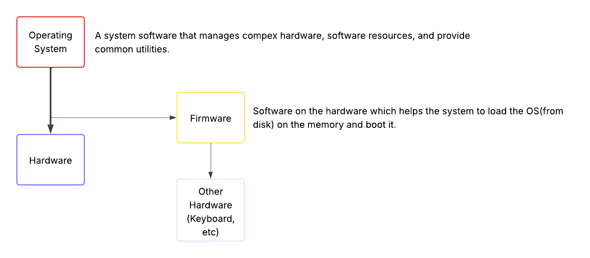
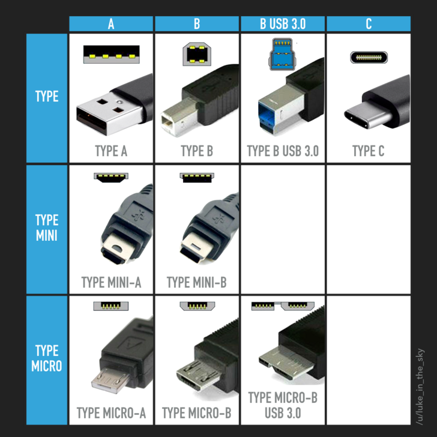
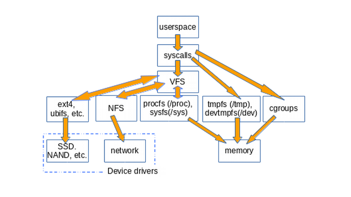

# 101-1 Determine and Configure Hardware Settings



- **BIOS**: Basic Input/Output system. Older firmware on motherboards. It loads OS from
  the first partition of the disk(MBR). It may not be efficient and sufficient for
  modern operating systems.
- **UEFI**: Unified extensible firmware interface. Use specific disk partitions for boot
  and uses FAT. -> /boot -> efi.

## Peripheral Devices

PCI: Peripheral Component Interconnect. -> Ports which let hardware boards be added on
the motherboard. Such as:

- Internal HDD
- External HDD
- Network Cards
- Bluetooth Dangles

### USB

USB: Universal Serial Bus



### GPIO

GPIO: General Purpose Input/Output. These are pins on a computer or an embedded device
that can be programmed to receive and send electric signals. -> Managed at
`/sys/class/gpio`.

## Sysfs

Sysfs is a pseudo/virtual file system in kernel's memory. Sysfs is mounted under `/sys`.
Devices shown in the `/sys` are not actually a userspace for working with them, it is
just a way kernel telling you what's going on with the hardware devices. It exports
information about various kernel subsystems, hardware devices, and associated device
drivers from kernel device model to userspace through virtual files. It provides info
about devices and drivers.

- **/sys/class/net/**: Shows network interfaces.
- **/sys/block/**: Shows block devices (hard drives, etc).

```bash
cd /sys/block/

ls
loop0  loop10  loop12  loop14  loop16  loop18  loop2   loop21  loop23  loop25  loop27
loop29  loop30  loop32  loop34  loop36  loop38  loop4   loop41  loop43  loop5  loop7
loop9 loop1  loop11  loop13  loop15  loop17  loop19  loop20  loop22  loop24  loop26
loop28  loop3   loop31  loop33  loop35  loop37  loop39  loop40  loop42 loop44  loop6
loop8  nvme0n1

cd nvme0n1

ls
alignment_offset  csi     discard_alignment  events             ext_range  inflight
mq     nuse       partscan                  queue      ro      stat       uevent
bdi               dev     diskseq            events_async       hidden     integrity
nguid  nvme0n1p1  passthru_err_log_enabled  range      size    subsystem  uuid
capability        device  eui                events_poll_msecs  holders
metadata_bytes  nsid   nvme0n1p2  power                     removable  slaves  trace
wwid

cd nvme0n1p1

ls
alignment_offset  dev  discard_alignment  holders  inflight  partition  power  ro  size
start  stat  subsystem  trace  uevent

cat partition
1

cat size
1048576

cat stat
     388      819    11982      609        3        0       10       28        0

cat alignment_offset
0

cat dev
259:1

cat discard_alignment
0

cat inflight
       0        0

cat ro
0

cat start
2048
```

You see, kernel is telling you what is going on with the first partition of your nvme
disk.

### What is a File System?

OK, this is a topic where I am going to cover and reexplain a lot in lpic1, is that
necessary? ABSOLUTELY!

According to early Linux contributor and author, Robert Love, A file system is a
hierarchial storage of data adhering to a specific structure. However, this description
applies equally to git, Cassandra, and VFAT. So what distinguishes a file system?

The Linux kernel requires for an entity to be a file system, it must implement the
open(), read(), and write() methods on persistent objects that have named associated
with them. From the OOP perspective, kernel treats the generic filesystem is an abstract
interface, and big three functions are virtual. **The kernel default implementation of a
filesystem is called virtual file system.**

```bash
file /dev/console
/dev/console: character special (5/1)

ls -l /dev/console
crw--w---- 1 root tty 5, 1 Jan  2 08:47 /dev/console

root>  tty
/dev/pts/7
root> echo "Hi" > /dev/pts/7
Hi
```

See, we can access, read, and write to a virtual teletype! Why? Because it is a file.

> :bulb: Everything is a file in Linux.

So, let me clarify a terminological confusion. The thing that we discuss earlier, are
referred as VFS(Virtual File System). It serves as an abstraction of filesystems.

On the other hand, we call `/proc/` and `/sys` are virtual file systems, meaning they
are implementations of filesystems that don't use disk storage.

> cgroups, tmpfs, and /dev do not call the big three file operations. They directly read
> and write to memory instead.



### Sysfs Deep Dive

Let's dive deeper into sysfs. I mean, why not?

So, forgetting the abstract explanations that sysfs is exporting information from
various linux subsystems and blah blah blah, I want to know what is sysfs showing
exactly?

#### kobjects

In the linux kernel, a `kobject` is the kernel's way of representing almost anything
that exists as an object. A device like hard drive, a loaded kernel module, a cpu core,
a networking interface, anything that the kernel manages can be a kobject.

Back to sysfs, how does sysfs and kobjects relate to each other? The kernel thought, "
Hey, we have these kobjects representing real things in the system. What if we exposed
them to userspace so the people and programs could inspect and modify them?".

Each kobject is a directory in `/sys` and the properties of the objects becomes files
that you can read or write on.

Inspecting and playing around the files in the `/sys` directory will make you understand
more from the system. For example, let's see that can we adjust the brightness of the
screen using sysfs.

```bash
cd /sys


find . -iname "*intel_backlight"
find: ‘./kernel/tracing’: Permission denied
find: ‘./kernel/debug’: Permission denied
./class/backlight/intel_backlight
./devices/pci0000:00/0000:00:02.0/drm/card1/card1-eDP-1/intel_backlight
find: ‘./fs/pstore’: Permission denied
find: ‘./fs/bpf’: Permission denied

cd ./devices/pci0000:00/0000:00:02.0/drm/card1/card1-eDP-1/intel_backlight

ls
actual_brightness  bl_power  brightness  device  max_brightness  power  scale  subsystem

ls -lrth brightness
-rw-r--r-- 1 root root 4.0K Jan  2 14:33 brightness

cat max_brightness
21333

echo 21333 > brightness
bash: brightness: Permission denied

sudo echo 21333 > brightness
bash: brightness: Permission denied

sudo su
root> echo 21333 > brightness
```

And suddenly my eyes are popping out because of the screen brightness!

## Udev

Udev(userspace devices) is a device manager for the Linux Kernel. It abstracts away the
hardware details. It is mounted under `/dev`. It contains device files that represents
hardware devices.

There are two interfaces that we can access data through them on linux systems. One is
called block-device interface(BDI) and the other one is called character-device
interface(CDI).

- CDI: A device which communicate with streams of characters. Like keyboards and sound
  cards. It basically receive and send single characters.

- BDI: In the contrast of character-device interfaces, these devices communicate data in
  chunks, not a stream of characters. Like hard disks.

- **/dev/sda**: First SATA/SCSI disks.

- **/dev/tty**: Terminal devices.

### Terminal

A terminal is just a place where you can type and execute commands. Additionally, a
terminal device is a system file that represents a terminal.

> 💡 Linux exposes everything as files.

There are 3 types of terminal devices:

- Virtual Consoles(TTY): These are the real terminals. You can use them using:

  ```txt
  Ctrl + Alt + [Fn] + F1, ..., F6
  ```

Each one is a terminal device:

```bash
ls /dev
tty tty0 tty1 tty01 tty1 ...
```

- PseudoTerminals(PTY): These are the terminals created by softwares(Gnome Terminal, SSH
  sessions, VS Code terminals, etc). These are mounted at `/dev/pts/`.

  ```bash
  root@ideapad:/dev/pts# tty
  /dev/pts/3
  ```

  Voila, I am inside a pseudoterminal(I am using gnome terminal).

- The current terminal: The controlling terminal of the current process.

  - The command for seeing the current terminal device: `tty`.

  ```bash
  echo "Hello, World" > /dev/tty
  Hello, World
  ```

> Each terminal session gets its own device file.

#### Historical / Hardware Terminals

These are historical devices with a keyboard and monitor, which they was able to do not
more than displaying the things comes from the wire and return what comes from the
keyboard.

> The real keyboard + monitor attached to the machine is represented by: `/dev/console`
> By the way, `/dev/ttyS0, ...` are physical serial ports(hardware terminals).

## Dbus

A message bus system, a simple way for applications to talk to each other.

## Proc

Pseudo filesystem that shows processes as file and some other things like `cpuinfo`,
`meminfo`, and some kernel settings. It is created on ram.

## Commands

- lsusb -> List usb devices.
- lsblk -> List block devices.
- lspci -> List PCI devices.
- lshw -> List hardware details.

## Kernel Modules

Kernel modules are the derivers in linux. They are loaded lazily. Most of them are
built-in. For preventing the kernel to load all at once, linux uses kernel modules(.ko
files). They are object files that are used to extend the kernel's functionality.

**Commands**:

- lsmod -> Show the status of modules in the Linux kernel -> Beautify `/proc/modules`
  contents.
- rmmod -> Remove a kernel module.
- insmod -> Insert a module into the kernel. You should specify the full path of module.
- modprobe -> Add or remove(mostly add) a module into the kernel. You can just send the
  name.
  - modprobe -r -> Remove the kernel module.
- modinfo -> Give information about the device.

## Other Things

- IRQ(Interrupt Request): Hardware lines used by devices to signal the CPU. Mounted at:
  `/proc/irq`

- I/O Ports: Memory addresses for device communication. Mounted at: `/proc/ioport`.

- DMA(Direct Memory Access): Allow devices to access memory without cpu intervention.
  Mounted at `/proc/dma`.

- **Cold Plug**: Devices present at boot time.

- **Warm Plug**: Devices that are added or removed while system is running.
