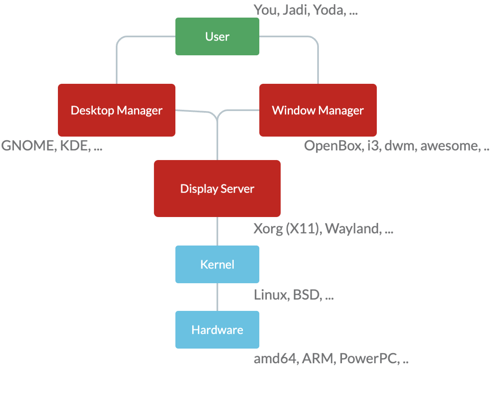

# Install and Configure X11

## Introduction

A GUI based operating system provides user the icons, mouse, windows, folders and other
graphical components. It provides us a desktop, a metaphor from our daily desktops. But
how does it happens? As many other things that happen in the Unix world, it happens via
layers of applications that are doing one thing well.



On the lowest level of abstraction, we have the hardware, the electric devices:). Then
we have kernel and its drivers on top of the hardware. On top of that, there is a
`Display Manager` or `Display Server`. This program can ask the operating system or the
kernel to perform low-level graphical actions on the screen. It perform what the desktop
manager requests. In other words, the display server accepts the desires of the UI(even
in a network channel) and translates them to the language that Kernel understand.

In this section we are focusing on X which is one of the two main display servers and
then we will have a brief look at the other one; the modern `wayland`. Honestly, I
really don't feel like it to write a lot and educate a lot about X. I am currently using
wayland anyway and I need to be educated on that. Also, I will try to provide another
lesson for myself in this `106` lesson, providing more details on how the GUIs works on
Linux and specially Ubuntu. Tbh I am doing it for learning and mastering how to
customize my desktop environments:).

## X

The X window system is a network transparent window system which runs on a wide range of
computing and graphics machines; including in most GNU/Linux distributions when they
need a graphical interface. It has a log history. It started with XFree86 then the X.org
started its own X server which is called X11 nowadays.

> These days when we say `X` we are referring to the whole family of the network
> protocols describing messages exchanging between a client and a display server.

### /etc/X11/xorg.conf

This is used to be the main configuration file for X. In recent days there is no such
file and X configures itself when starting and does not need a config file. But anyway,
you can create a new `xorg.conf.new` file by running the following command:

```bash
Xorg -configure
```

The file has various sections. I will just bring up the titles and a simple description:

- **Files**: This part is about fonts and font paths.
- **Module**: These are the modules that X should load.
- **InputDevice**: Define mouse, keyboard, touchpad, and similar tools. Have an
  `Identifier`, `Driver`, and some `Option`s.
- **Device**: Define graphic cards, and similar tools. Have an `Identifier`, `Driver`,
  `BusID`, and some `Option`s.
- **Monitor**: The monitor. Have an `Identifier` and some `Option`s.
- **Screen**: The screens. Have an `Identifier`, `Device`, and some `SubSection`s
  defining color modes and resolutions.
- **ServerLayout**: The glue. Has an `Identifier`, `Screen`, and some `InputDevice`s,
  and maybe some other things who knows(and gives a f nowadays?).

### ~/.session-error

In case of any issues during the start of X, the errors will go here.

### xhost

This command controls the access to the X server. As I said before, the X window system
is a network transparent window system, meaning you can have the GUI of a remote machine
on your local screen! Sth like that.

```bash
> xhost
access control enabled, only authorized clients can connect
SI:localuser:ali

> xhost +
access control disabled, clients can connect from any host

> xhost -
access control enabled, only authorized clients can connect

> xhost +192.168.42.85
192.168.42.85 being added to access control list

> xhost
access control enabled, only authorized clients can connect
INET:192.168.42.85    (no nameserver response within 5 seconds)
SI:localuser:ali
```

Now the `85` machine can send its graphical request to this machine. But how to display
things on the client machine?

```bash
> echo $DISPLAY
:0

> export DISPLAY=192.168.42.89:0
xeyes  # Shown at the current machine, but processed by the remote machine.
```

Nowadays this won't work most of the time because of security concerns.

### xauth

In this method, X creats an .XAthority file in the home and whoever knows about the
contents, can contact X.

> If your `X` is not working, one step might be removing the .XAuthority file.

## Local Configurations and Vendor Configuration

Use `something.conf.d/` directory for your local configuration, and let the
`something.conf` file be the main configuration file, so that the vendor can update it
in each update, by also keeping your own local configuration. Smaller and atomic:).
Remember:)? Btw this is happening in X11 too. There is `/etc/X11/xorg.conf` file and a
`/etc/X11/xorg.conf.d/` directory. The main file should be untouched.

## Wayland

X11 is super old and is only usable via lots of patches and hacks. One of its developers
started a modern display manager called `wayland`. Most of the distros has adapted to
the wayland display server. Wayland is more secure and much easier to maintain. I will
be talking more of it in a feature lesson:).
