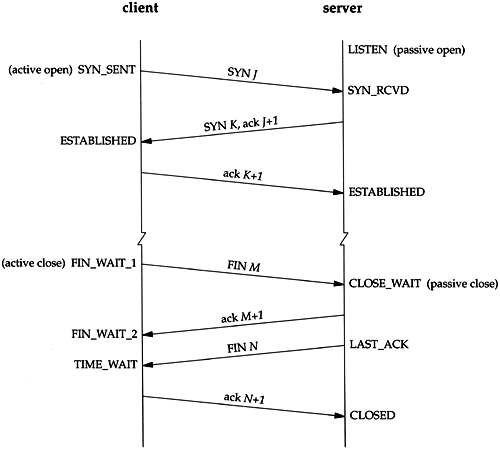

# Fundamentals of Internet Protocol

## TCP/IP

The Transmission Control Protocol/Internet Protocol is a stack of protocols which powers
the most of the communications on the internet and other networks. The first part is
called TCP but don't get it wrong, the stack includes other things such as UDP, ICMP,
DNS and other tools and protocols.

## IP

Internet Protocol or **IP** is a way logically pointing to a host on the internet. It is
a set of standards and rules for addressing and routing data on the internet.

When a device has an **IP Address**, it is possible to send data toward it. The IP
address should be unique so the network know where each packet is intended to go. We
have IPv4 and IPv6, two active versions of the protocol.

An IPv4 is formatted in four octets, which each octet is a number from 0-255(2^8). We
can have 4.3(2^32) IPv4.

```txt
1.2.3.4
1.1.1.1
100.0.0.100
192.168.1.4
```

Each octet is constructed of an 8 bit number and can be shown in binary or hex formats,
but decimal format is more common.

### Private IPs

4.3 billion IPs are not enough for modern era, so experts came up with a solution:
`Private IPs`. People should get their public IP addresses from a central authority
called Internet Assigned Numbers Authority(IANA). The available IP addresses are grouped
in three classes:

| Range                 | Number of IPs in this range |
| --------------------- | --------------------------- |
| 192.168.0-255.0-255   | 65K IPs                     |
| 172.16-31.0-255.0-255 | 1M IPs                      |
| 10.0-255.0-255.0-255  | 16M IPs                     |

These are the private IP address ranges. They can assign them to any device they want in
their private network and as long as they are not visible to the internet.

<!-- markdownlint-disable MD013 -->

```txt
                                                                                          XXXXXX
                                                                      XXXXXX   XXXXX    XXX    XX
              +--------+                                              X     XXXXX   XXXXXX       XX
    +--------+172.16. |                                             XX                           X
    |        |1.1     |                                             X                            X
+--------+    |        |                                             X                           XX
|192.168.|    +--------+                                           XXX  Internet, Only         XX
|2.100   |         |           +-----------------+              XXXXX   uses Public          XXXX
|        |         |           |                 |           XXX        IP Addresses        XX
+--------+    Private Network  | NAT, Translates |Public IP XX                              X
    |             +-----------+ between Public  +---------+X      Devices with Private IPs  XX
    |             |           | and Private IPs | 87.3.91.4 XX     reach the Internet via     X
+--------+     +--------+      |                 |           XX    the Public IP configured   XX
|192.168.|     |        |      |                 |            XXX    on their NAT device.     X
|2.200   |     |172.16. |      +-----------------+               XX                          XX
|        |     |1.2     |                                      XXX                           X
+--------+     |        |                                     XX                             XX
              +--------+                                     X                               XX
                                                              X                              XXX
                                                              XX                           XXX
                                                                XX    XXXXXXX     XXXXXXXXXX
                                                                XXXXXX     XXXXXXX
```

<!-- markdownlint-enable MD013 -->

Between the private and public(internet) network, there is a NAT device. It is connected
to the internet only by one public IP address. Every time the devices in the private
network targets and IP in the internet, the NAT device will use its own public IP
address to request that IP address, and when the answer is ready, it will provide it to
the Natted device(the device behind NAT).

## Subnetting and Netmask

Imagine a scenario when my system using its IP address wants to send packets to the
printer's IP address. Should the packet go through the whole internet to find my
printer? Absolutely not. The packet should only be inside my local network and the
printer should receive it on its own local IP address.

This is achieved by subnetting. By subnetting your network, you create sub-networks in
your IP address range. When speaking about networks, you have to decide on:

- How many bits of my IP address are going to be shared between all my devices (network
  portion).
- How many bits of my IP address are going to differentiate my device in the network
  (host portion).

There are two main notations for subnetting:

- **Subnet mask**: `1`s specify the bits that are shared in the network, `0`s are the
  bits that can differ in devices.
- **CIDR(Class Inter-Domain Routing)**: The count of `1` bits.

| Decimal       | CIDR | Binary                              |
| ------------- | ---- | ----------------------------------- |
| 255.0.0.0     | /8   | 11111111.00000000.00000000.00000000 |
| 255.255.0.0   | /16  | 11111111.11111111.00000000.00000000 |
| 255.255.255.0 | /24  | 11111111.11111111.11111111.00000000 |

By subnetting our network, now every packet that tries to reach a destination in my
subnet, will be routed correctly. But if any device tries to reach anything out of my
subnet, my router will use its NAT functionality to send packets over the internet.

### Network and Broadcast Addresses

By having the IP address and the network mask, we can calculate the network and
broadcast addresses.

The network address it calculated by performing logical AND operation between the IP
address and network mask. The broadcast address is calculated by performing logical OR
operation between the IP address and inverted network mask.

```txt
IP:        11000000.10101000.00000100.00001100 (192.168.4.12)
Netmask:   11111111.11111111.11111111.00000000 (255.255.255.0)
Network:   11000000.10101000.00000100.00000000 (192.168.4.0)
Broadcast: 11000000.10101000.00000100.11111111 (192.168.4.255)
```

## Communication Protocols

These protocols are used when computers are communicating. Each protocol is designed for
specific reasons and use cases, letting the computers talk to each other in different
ways, fulfilling different needs.

### TCP

Transmission Control Protocol(TCP) is designed to make sure that both parties are
communicating with each other without loosing any information. In this protocol all the
data should be transmitted completely. Can you name use cases where the TCP protocol
should be used?



As you can see, TCP has a lot of overhead, making sure the connection is successfully
established. There are cases we want the data transmission continues, even if we don't
receive all the data. Think of watching an stream or a phone call. This is why we have
UDP.

### UDP

User Datagram Protocol(UDP) is an unreliable connectionless packet protocol. It won't do
much communication with the receiver. We have mentioned the use cases we should use UDP.
It is much faster than TCP.

### ICMP

Internet Control Messaging Protocol or ICMP is a specific protocol used to check the
connectivity of servers by `ping` command. The first computer asks: "Are you there?" and
the second computer answers: "Yes I am here.".

```bash
ali> ping google.com
PING google.com (216.239.38.120) 56(84) bytes of data.
64 bytes from any-in-2678.1e100.net (216.239.38.120): icmp_seq=1 ttl=110 time=107 ms
64 bytes from any-in-2678.1e100.net (216.239.38.120): icmp_seq=2 ttl=110 time=131 ms
64 bytes from any-in-2678.1e100.net (216.239.38.120): icmp_seq=3 ttl=110 time=155 ms
```

> ICMP is used for network troubleshooting and it does not transfer user data.

### Ports

IP addresses can tell the destination of the packets but when a packet is received to a
device, which system should process it? The decision is made by ports. Service are
running on different ports, which enables the device to handle the packets to the
services. The services(e.g. SSH) starts listening on ports(e.g. 22) and receive the
packets that was previously send to their ports.

Different ports can use different transmission control protocols(e.g. TCP or UDP). You
should know the default ports of the famous protocols.

| Port(s)  | Usage                  |
| -------- | ---------------------- |
| 20, 21   | FTP (data and control) |
| 22       | SSH                    |
| 23       | Telnet                 |
| 25       | SMTP                   |
| 53       | DNS                    |
| 80       | HTTP                   |
| 110      | POP3                   |
| 123      | NTP                    |
| 139      | NetBIOS                |
| 143      | IMAP                   |
| 161, 162 | SNMP                   |
| 389      | LDAP                   |
| 443      | HTTPS                  |
| 465      | SMTPS                  |
| 636      | LDAPS                  |
| 993      | IMAPS                  |
| 995      | POP3S                  |

> Most of the ports above 400 has an `S` at the end of their corresponding service,
> standing for `Secure`.

## IPv6

Previously I mentioned we does not have enough IPv4 addresses. Different versions of IP
are implemented and currently, IPv6 is getting more used. We can have `2^128` IPv6s.
That's more than enough. The address consists of `128` bits, which are shown in 8, 16
bits groups and they are normally written in hex format.
`2001:0db8:0a0b:12f0:0000:0000:0000:0001` is an example of an IPv6 address, which the
`:0000:` can be shown as `::` and be reformatted like `2001:db8:a0b:12f0::1`.
