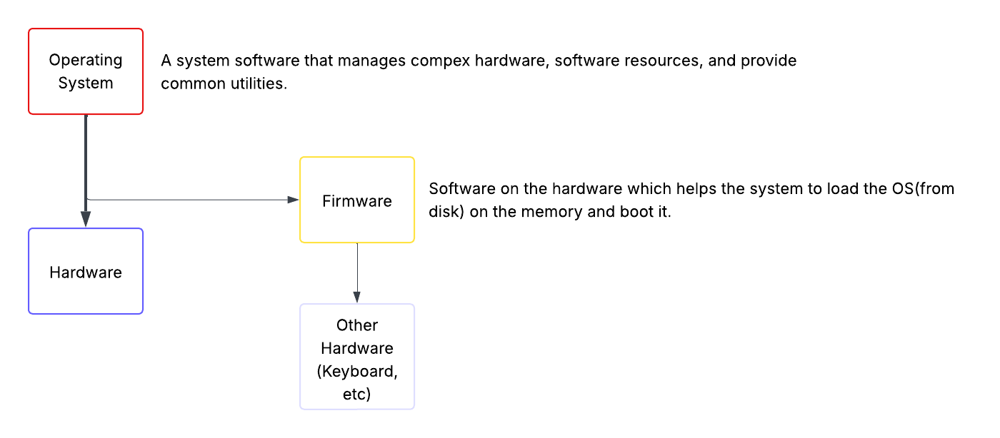

# 101-1 Determine and Configure Hardware Settings

- **BIOS**: Basic Input/Output system. Older firmware on motherboards. It loads OS from
  the first partition of the disk(MBR). It may not be efficient and sufficient for
  modern operating systems.
- **UEFI**: Unified extensible firmware interface. Use specific disk partitions for boot
  and uses FAT. -> /boot -> efi.

## Peripheral Devices

PCI: Peripheral Component Interconnect. -> Ports which let hardware boards be added on
the motherboard. Such as:

- Internal HDD
- External HDD
- Network Cards
- Bluetooth Dangles

### USB

USB: Universal Serial Bus

### GPIO

GPIO: General Purpose Input/Output. These are pins on a computer or an embedded device
that can be programmed to receive and send electric signals. -> Managed at
`/sys/class/gpio`.

## Sysfs

Sysfs is a pseudo file system in kernel's memory. Sysfs is mounted under `/sys`. Devices
shown in the `/sys` are not actually a userspace for working with them, it is just a way
kernel telling you what's going on with the hardware devices. It exports information
about various kernel subsystems, hardware devices, and associated device drivers from
kernel device model to userspace through virtual files.

## Udev

Udev(userspace devices) is a device manager for the Linux Kernel. It abstracts away the
hardware details. It is mounted under `/dev`

## Dbus

A message bus system, a simple way for applications to talk to each other.

## Proc

Pseudo filesystem that shows processes as file and some other things like `cpuinfo`,
`meminfo`, and some kernel settings. It is created on ram.

## Commands

- lsusb -> List usb devices.
- lsblk -> List block devices.
- lspci -> List PCI devices.
- lshw -> List hardware details.

## Kernel Modules

Kernel modules are the derivers in linux. They are loaded lazily. Most of them are
built-in. For preventing the kernel to load all at once, linux uses kernel modules(.ko
files). They are object files that are used to extend the kernel's functionality.

**Commands**:

- lsmod -> Show the status of modules in the Linux kernel -> Beautify `/proc/modules`
  contents.
- rmmod -> Remove a kernel module.
- insmod -> Insert a module into the kernel. You should specify the full path of module.
- modprobe -> Add or remove(mostly add) a module into the kernel. You can just send the
  name.
