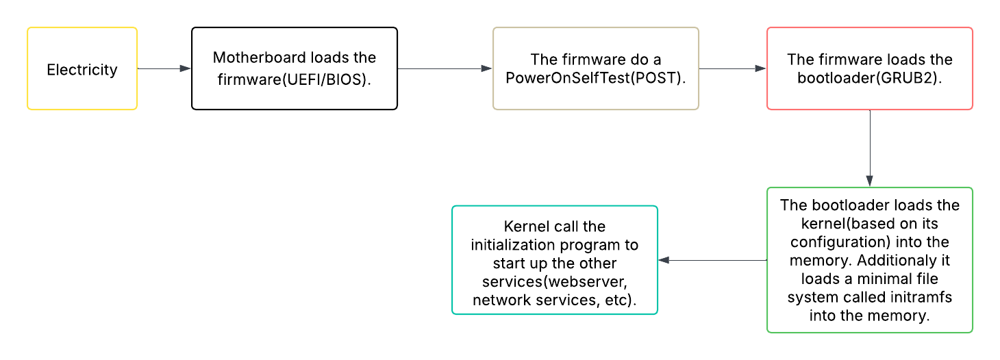

# Boot the System



## Boot logs

Linux will show you the boot process logs during the boot. It hides it under a fancy
splash screen which you can hide using `Esc` or `Ctrl+Alt+F1`.

While booting, there are stages when the system hasn't loaded the related drivers for
interacting or writing to the disk, which will force kernel to write the boot logs on
the *Kernel Ring Buffer*. After the boot, you can see the logs using the command:
`dmesg`. Also you could view the file `/var/log/dmesg`, `/var/log/boot.log` or
`/var/log/boot`. Additionally, you can use `journalctl -k` to check the kernel logs or
use `journalctl -b` to check the boot logs.

- journalctl -u kernel -> Use it to see all the previous kernel logs.

After the init process come up, syslog daemon will log message at: `/var/log/messages`
or `/var/log/syslog`.

## Init Process

When the kernel initialization is finished, it is time to start other programs. This is
where the kernel runs the initialization daemon process, and it takes care of starting
other services.

Different init systems:

- SysVinit: It is based on Unix System V. Not being used so much these days but people
  loved it because it followed the unix philosophy.
- Upstart: A replacement for SysVinit, which canonical was developing it around 2014.
  With the addoption of systemd, the development stopped.
- <mark/>Systemd<mark/>: It is the new replacement of SysVinit. It is widely adopted and
  somehow hated by some people in the linux community, because it does not follow the
  unix philosophy as much as it should be(maybe? idk).

> The init process has the id of 1.

```bash
which init
/usr/sbin/init

readlink -f init
/root/init

ls -la /usr/sbin/init
lrwxrwxrwx 1 root root 20 Jun  4 17:47 /usr/sbin/init -> /lib/systemd/systemd
root@ideapad:~#
```

### Systemd

It is build around units. A unit can be a service, group of services, or an action.
every unit has a name, a type, and a configuration file. We have 12 unit types:
automount, device, mount, path, scope, service, slice, snapshot, socket, swap, target
and timer. We will be dealing the most with the `service` and `target`.

**We use systemctl to work with units and journalctl to see the logs.**

The unit files can be found in(sorted by priority):

1. **/etc/systemd/system**
2. **/run/systemd/system**
3. **/usr/lib/systemd/system**

- systemctl list-unit-files -> Get all the unit files.
- systemctl cat postgresql.service -> Read the unit file and tell the location of it.
- systemctl start sshd -> Start a service.
- systemctl stop sshd -> Stop a service.
- systemctl status sshd -> Get the status of a service.
- systemctl restart sshd -> Restart a service.
- systemctl reload sshd -> Reload the configuration of the service.
- systemctl daemon-reload sshd -> Reload the systemd unit file of the service.
- systemctl is-active sshd -> Tell wether or not the service is active.
- systemctl is-failed sshd -> Tell wether or not the service is failed.
- systemctl enable sshd -> Will run the service up at the startup.
- systemctl disable sshd -> Won't run the service at the startup.
- systemctl is-system-running -> Get the status of the system and systemd.
- systemctl --failed -> Return failed services.
- systemctl list-units --type={type} -> List the units with the specified type.

### Journalctl

It is used by checking the logs. We use it to query the contents of `system` journal,
which is written by `systemd-journald.service`.

- journalctl -> Show all journal.
- journalctl --no-pager -> No `less`. You won't probably need this.
- journalctl -n 10 -> Only 10 lines.
- journalctl -S -1d -> Last 1 day.
- journalctl -xe -> Last few logs.
- journalctl -u sshd -> Logs of a unit.
- journalctl \_PID=1234 -> Logs of a process.

### SysV

It is the older init system. The control files are located at the `/etc/init.d/`. They
are close to general bash scripts.

```bash
/etc/init.d/sshd stop
/etc/init.d/sshd stop
/etc/init.d/sshd status
```
