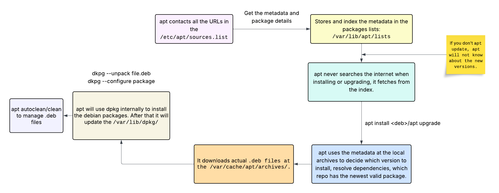

# Use Debian Package Management

## What is a Package Manager

I context of Linux, A package manager is a software that goes through all these
processes and automate the finding, downloading, unpacking, uncompressing, installing,
set up, and update of the programs you install on your linux distribution.

> A package manager helps you keep track of the libraries and dependencies of the
> program you're installing. It can make two programs depending on a specific version of
> a library to run, dynamically link to the library. This improves space efficiency.

*Without a package manager you should find and download the program from the source and
do all the steps manually.*

### Why You Should Use a Package Manager?

1. **Security**: Package managers have the advantage of security for two primary
   reasons. First, they do an anti-virus check on every software that goes through it.
   The seconds reason is that they won't let a package publish to the package manager
   repositories without acquiring a certain amount of information from the package and
   the publisher of it.
2. **Convenience**: It is easy to use and automate a lot effort.
3. **Compatibility**: Resolve, alert and find conflicts between packages and libraries,
   making sure they wouldn't break the system.
4. **Interoperability**: They can be run on different systems and operating-systems.
5. **Updates**: Makes updates super easy.
6. **Efficiency and Space**: As I said before, package managers can let softwares share
   the libraries they are using.

## .deb File

`.deb` is the package format used by Debian-based distros. Think of it as compressed
archives and metadata that tell you how to install a software.

A `.deb` file has:

- debian-binary: A text file whit the version of the package format (usually "2.0").
- control.tar.\*: Metadata, package name, version, dependencies, maintainer info, and
  install/remove scripts.
- data.tar.\*: The actual payload, binaries, libraries, configurations, documentations,
  and basically any file that should end up in the filesystem.

```bash
dpkg-deb -c tmux.deb  # List contents
dpkg-deb -I tmux.deb  # Return metadata
new Debian package, version 2.0.
size 428388 bytes: control archive=1335 bytes.
  1112 bytes,    22 lines      control
    445 bytes,     7 lines      md5sums
    156 bytes,    11 lines   *  postinst             #!/bin/sh
    84 bytes,     9 lines   *  postrm               #!/bin/sh
    228 bytes,    10 lines   *  preinst              #!/bin/sh
Package: tmux
Version: 3.2a-4ubuntu0.2
Architecture: amd64
Maintainer: Ubuntu Developers <ubuntu-devel-discuss@lists.ubuntu.com>
Installed-Size: 1026
Depends: libc6 (>= 2.34), libevent-core-2.1-7 (>= 2.1.8-stable), ...
Section: admin
Priority: optional
Homepage: https://tmux.github.io/
Description: terminal multiplexer
tmux enables a number of terminals (or windows) to be accessed and
controlled from a single terminal like screen. tmux runs as a
server-client system. A server is created automatically when necessary
and holds a number of sessions, each of which may have a number of
windows linked to it. Any number of clients may connect to a session,
or the server may be controlled by issuing commands with tmux.
Communication takes place through a socket, by default placed in /tmp.
Moreover tmux provides a consistent and well-documented command
interface, with the same syntax whether used interactively, as a key
binding, or from the shell. It offers a choice of vim or Emacs key
layouts.
Original-Maintainer: Romain Francoise <rfrancoise@debian.org>
```

## dpkg

dpkg is the software at the base of the package management system in Debian-based
distributions. It is the low-level package manager of Debian-based systems.

**General format of dpkg: `dpkg [OPTIONS] package.deb`.**

| Switch         | Description                                                 |
| -------------- | ----------------------------------------------------------- |
| -i/--install   | Install a debian package.                                   |
| -p/--purge     | Remove the executables and configurations.                  |
| -r/--remove    | Remove the executables.                                     |
| -c/--contents  | Show the contents of a package.                             |
| -C/--audit     | Search for broken installed packages and propose solutions. |
| -I/--info      | Show info of the package.                                   |
| -s/--status    | Show the status of the package.                             |
| -S/--search    | Search `/var/lib/dpkg/status`.                              |
| -l/--list      | List all the installed packages.                            |
| -L/--listfiles | List all files related to a package.                        |
| --configure    | Reconfigure installed package.                              |

> In cases a package is installed without proper dependencies, you can use
> `apt install -f`. -f stands for fix broken.

### Reconfigure a Package

For reconfiguring an already configured package, do:

```bash
dpkg-reconfigure tzdata
```

### What does it do?

It installs, removes, and queries `.deb` packages locally, without resolving
dependencies. Everything it does it is based on the local files and local package
metadata stored under `/var/lib/dpkg/` directory.

## apt

It is the high-level package manager of Debian-based systems. It does everything a
package manager should do and have all their advantages.

> apt is not secure by itself. You can download malware from people's personal
> repositories and no one is stopping you for doing that.

All major distros have their own huge archives of pre-compiled software, called
repositories. There is also a package manager that care take of finding and installing
them.

> Debian package name format: `NAME_VERSION-RELEASE_ARCH.deb`.

### apt Repository

apt repositories are the sources, repositories, and places where apt gets software from.
A repo can be on a disk, network drive, collection of DVDs, or most commonly, on a
network address on the internet.

The main place these repositories are configured and set is at `/etc/apt/sources.list`.
Other repositories you add later will go under: `/etc/apt/sources.list.d/`.

```bash
root@ideapad:/etc/apt/sources.list.d> ls
deadsnakes-ubuntu-ppa-jammy.list      docker.list         nodesource.list  rabbitmq.list
diodon-team-ubuntu-stable-jammy.list  google-chrome.list  pgadmin4.list    termius.list
```

### apt Commands

| Command                          | Description                                                                                                                |
| -------------------------------- | -------------------------------------------------------------------------------------------------------------------------- |
| apt install tmux                 | Install/Update a package from repo.                                                                                        |
| apt install -s tmux              | Simulate the installation.                                                                                                 |
| apt remove tmux                  | Remove the package(doesn't remove the dependencies).                                                                       |
| apt autoremove                   | Remove unused dependencies.                                                                                                |
| apt install --download-only tmux | Download packages as cache in `/var/cache/apt/archives/`.                                                                  |
| apt download tmux                | Download the debian package.                                                                                               |
| apt search grub2                 | Search the package name in the repositories.                                                                               |
| apt dist-upgrade                 | Going to new distribution.                                                                                                 |
| apt update                       | Download latest package metadata from the repositories lists. The metadata are locally stored under `/var/lib/apt/lists/`. |
| apt upgrade                      | Upgrade all installed packages to the latest versions in the repositories.                                                 |
| apt clean                        | Remove all cached `.deb` files in the `/var/cache/apt/archives/`.                                                          |
| apt autoclean                    | Remove only outdated cached `.deb` files in the `/var/cache/apt/archives/`.                                                |



**The above commands are for apt-get and apt-cache too. apt-get can run all the commands
except search. apt-cache will handle that.**

Other apt-cache commands which apt doesn't have them(except for `depends`):

| Command                                | Description                               |
| -------------------------------------- | ----------------------------------------- |
| apt-cache depends tmux                 | Return the dependencies of a package.     |
| apt-cache pkgnames (apt don't have it) | Get all the package names.                |
| apt-cache showpkg tmux                 | Show the package information.             |
| apt-cache stats                        | A general stats from packages.            |
| apt-cache unmet tmux                   | List the unmet dependencies of a package. |

### PPA

A Personal Package Archive(PPA) is canonicals take on apt software repositories. It is a
software repository that anyone can create but only Ubuntu users can use. Canonical made
PPAs so people without the money, resources, or knowledge of creating their own
repository servers, host their own ppa repo on `launchpad.com`. There are not much
difference between an apt repository and a ppa. A apt repo is a collection of packages,
hosted on an arbitrary server. A PPA is also a collection of packages, hosted on the
launchpad servers. So PPAs are special kinds of repository.

> Sometimes, people developing packages abandon them and this action results to security
> issues not being fixed and conflicts on library versions and packages.

**There are some GUIs for managing the packages but meh, I don't like them.**
