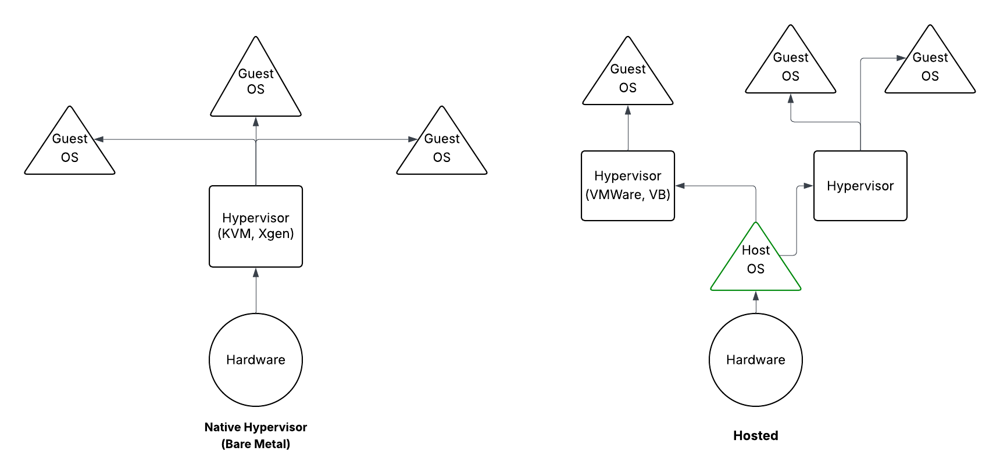

# Linux as a Virtualization Guest

## Virtual Machines

Virtual machines are simulated computers. They enable you to have multiple machines on
your hardware. They are managed by a software named **Hypervisors**. We have two types
of hypervisors.



How could we check that if our OS supports virtual machines or are we even inside of a
virtual machine?

```bash
lscpu
# Or cat /proc/cpuinfo, if there was a vmx(for intel) or svm(for amd) flag, the
# virtualization is supported. If you see a hypervisor flag, you're inside a vm.
# supported
dmesg | grep -i virtual
dmesg | grep -i hypervisor
# There are vm and hypervisor related logs in the boot logs.
cat /sys/class/dmi/id/product_name
VirtualBox  # Voila! You are on a virtualbox guest os.
```

Also, there is `systemd-detect-virt` and a higher level bash script `virt-what` for
getting information about the host or vm.

```bash
systemd-detect-virt
oracle
systemd-detect-virt -v  # VM only
oracle
systemd-detect-virt -c  # Container only
none
virt-what
virtualbox
kvm
```

### Type 2 Hypervisor

These kind of hypervisors run on the host operating-system. Basically they are the
software between the host and guest operating systems. They run like any other program
on the host OS and they abstract guest operating systems for host OS. The famous ones
are VMWare and Virtualbox.

### Type 1 Hypervisor

These are the default options for the production level virtual machines. They are run
directly on the machine's hardware. KVM module in the Linux Kernel enable this type of
virtualization.

### How to create a virtual machine?

First, create the machine itself. Specify how much RAM, CPU, and other resources you
want to specify for the machine. Then we need to install the guest os, this could be
done by:

- Create a new vm by inserting a CD/DVD drive.
- Cloning an existing machine.
- Using a Open Virtualization Format(OVF) to move machine between the hypervisors. This
  is the standard format for virtual machine definition and may include several files.
  In this case you can archive them into a Open Virtualization Archive(OVA) file.
- Create one using a Template. They are master copies to initiate a new machine.

### What should you do after cloning a virtual machine?

Make sure you modify the host-specific configuration of the virtual machine. The
configuration should be:

- Hostname.
- NIC MAC Address.
- NIC IP (If not using DHCP).
- Machine ID. It is located at `/etc/machine-id` and `/var/lib/dbus/machine-id`. Then
  you should run the command `dbus-uuidgen --ensure`. These files might be soft links to
  each other.
- Encryption keys like SSH fingerprints.
- HDD UUIDs.
- All the remaining unique id in the system.

> Some configs might be empty on the templates. Do not forget to fill them.

## Containers

Containers are OS-level virtualization. They use the same kernel as the host use.
OS-level virtualization is an operating-system paradigm in which the kernel allows the
existence of multiple isolated user-space instances, called the containers.

For more information, refer to the
[Containerization introduction](../containerization/base.md).

Containers are mostly used to run an application or a service.

## IAAS

As the name implies, Infrastructure as a Service or IAAS means offloading parts of your
infrastructure to another company. This mean buying services like electricity, power,
cooling devices and such like things to another company and just renting your virtual
machine from them. In a more technical manner, IaaS provides virtualized compute,
storage and network over the internet, allowing you to run VM without managing the
physical hardware. This is called **Cloud**! Again, in a more technical manner, the term
`cloud` refers to the servers that are accessed over the internet, and the software and
databases that run on them. Cloud providers abstract the physical hardware and expose
them as scalable, programmable services.

Sample of cloud providers: AWS, Google Cloud, Azure, etc.

Examples of different levels of infrastructure as a service that cloud providers
provide:

- Load Balancing: Distribute incoming request across different servers.
- Block Storage: Providing disks to be configured and added to your machines.
- Object Storage: Lets you store your data directly. Like your photos.

**Cloud Stack:**

1. SaaS (Application)
2. PaaS (Runtime Platforms)
3. IaaS (Virtual Hardware)
4. Physical Hardware
