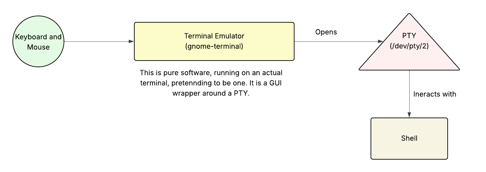

# Work on the Command Line



- Terminal: An old physical device with a keyboard and a monitor, connected to a system
  and its job was send keystrokes through wire and display characters. We have talked
  about it in [101-1 Determine and Configure Hardware Settings](101-1.md)
- TTY: Kernel's endpoint for a terminal connection. We have TTYs that are virtual
  consoles reached by the OS in text-mode or doing `Alt + Ctrl + F3` for example. We
  have PTYs that are pseudo terminals used by terminal emulators.
- Shell: The program that interprets to the commands coming from the terminal and
  response them.
- Terminal Emulators: THe GUI softwares wrapped around PTYs.

```bash
readlink /bin/bash  # Return the system's POSIX shell
dash
echo $SHELL  # Return the login shell
bash
```

> The bash has some internal commands that will understand by its own(cd, exec, etc). If
> it does not understand something internally, it will try to run it as an executable.

So how does the shell knows what are we trying to run by typing a command(e.g. ping).
First the terminal will check its own commands. If the command was not there, shell keep
looking for the executable file in the $PATH directories, in order the directories are
defined and separated by `:`.

```bash
echo $PATH
/usr/local/sbin:/usr/local/bin:/usr/sbin:/usr/bin:/sbin:/bin:/usr/games:...
```

> For telling Linux to run the program inside a directory, you should use `./program`.
> This was done due to security concerns, can you remember why:)?

You can check the type of a command with `type` command. It indicate how the command
would be interpreted.

```bash
type cd
cd is a shell builtin

type ping
ping is /usr/bin/ping

type exec
exec is a shell builtin

type spotify
spotify is /snap/bin/spotify

type set-proxy-manual
set-proxy-manual is aliased to `gsettings set org.gnome.system.proxy mode 'manual''
```

**Commands**:

| Command | Description               |
| ------- | ------------------------- |
| cd      | Change directory          |
| uname   | Print system information  |
| pwd     | Get the current directory |

```bash
uname
Linux

uname -a  # Get all the info we want
Linux ideapad 6.8.0-87-generic #88~22.04.1-Ubuntu SMP PREEMPT_DYNAMIC ...

uname --help
Usage: uname [OPTION]...
Print certain system information.  With no OPTION, same as -s.

  -a, --all                print all information, in the following order,
                             except omit -p and -i if unknown:
  -s, --kernel-name        print the kernel name
  -n, --nodename           print the network node hostname
  -r, --kernel-release     print the kernel release
  -v, --kernel-version     print the kernel version
  -m, --machine            print the machine hardware name
  -p, --processor          print the processor type (non-portable)
  -i, --hardware-platform  print the hardware platform (non-portable)
  -o, --operating-system   print the operating system
      --help     display this help and exit
      --version  output version information and exit
```

## Man

Man is a reference to the system reference manuals. Man everything you don't know.

Man pages are categorized in different sections(books). `man 5 passwd`.

1. Executable programs or shell commands
2. System calls (functions provided by the kernel)
3. Library calls (functions within program libraries)
4. Special files (usually found in /dev)
5. File formats and conventions, e.g. /etc/passwd
6. Games
7. Miscellaneous (including macro packages and conventions), e.g. man(7)
8. System administration commands (usually only for root)
9. Kernel routines [Non standard]

## Escaping Special characters

You know what are special characters. Characters that have a special meaning in their
interpretation environment. You can escape those using back-slashes `\` in the shell.

Especial characters in the shell: `* ?[]'"\$;&()|^<>`.

> In addition of being an escape character, `\` is used to create special characters.
> You can use `\` to break the commands into more lines.

```bash
echo Hi \
  Another Hi
Hi Another Hi
```

| Escape Sequence Function | Description                                    |
| ------------------------ | ---------------------------------------------- |
| \\a                      | Alert(Beep)                                    |
| \\b                      | Backspace                                      |
| \\c                      | Suppress trailing new line (same as -n option) |
| \\f                      | Clear the screen on a video display            |
| \\n                      | New line                                       |
| \\r                      | Carriage return                                |
| \\t                      | Horizontal tab                                 |

## Shell and Environment Variables

Shell variables are key-value pairs saved in the shell memory. They are read and set by:

```bash
x=10
echo $x
10
```

On the other hand, environment variables are the key-value pairs in the process
environment, passed from parent processes to the child processes. `export` would make a
shell variable turn into an environment variable by including it inside the process
environment.

```bash
export x=10
echo $x
10

bash
echo $x
10
```

### Process Environment

Every running program, aka process, has a private data structure maintained by the
kernel inside the memory. It contains:

- Environment variables(key-value strings).
- Program arguments(argv).
- Auxiliary metadata.

Basically it is a small block of memory which kernel attaches it to every process to
store environment variables. This block is inherited by the child processes when the
parent process do fork -> exec. The child process can just change their own local copy
of environment variables, not the actual parent version of the variables.

```txt
Bash Process
  ├─ Shell variables (internal memory of the bash)
  ├─ Process environment (kernel-maintained memory block)
```

Also, environment variables hold configuration values that programs(including the shell)
can read.

| Environment Variable | Description                                 |
| -------------------- | ------------------------------------------- |
| SHELL                | The shell.                                  |
| LANG                 | Language of the system.                     |
| PWD                  | Current directory.                          |
| OLDPWD               | Previous directory.                         |
| USER                 | Current logged-in user.                     |
| <mark>PATH</mark>    | List of directories to search for commands. |
| HISTFILE             | Where bash should save its history.         |
| EDITOR               | Default editor.                             |
| PS1                  | The prompt.                                 |
| UID                  | The numeric id of the logged-in user.       |
| $                    | The process id.                             |
| PID                  | The parent process id.                      |
| ?                    | The exit code of the last command.          |
| HOME                 | The home directory of the user.             |

## History File

Bash will write the history of the execute commands in the `$HOME/.bash_history`. Also,
you can use the **history** command.

Mostly, I use the `Ctrl + R` for reverse search. Some related helpful commands and
shortcuts:

> Set the `HISTSIZE` environment variable to 0 for not saving your commands.

- `Ctrl + O`: Execute the command.
- `!1`: Run the <number>th command.
- `!!`: Run the last command.
- `!fastapi`: Run the last command that included `fastapi`.
- `Up and Down Arrow`: Yk what do they do:)

> Use **exit** or `Ctrl + d` to exit the shell.

Lets observe some other commands:

- **whereis**: Locate the binaries, sources, and manual pages for the command.
- **whatis**: Display one-line manual description.
- **which**: Locate a command.

> Global bash configs are stored at `/et/profile`. Each user has her configuration at
> `~/.profile`, `~/.bash/_profile`, and `~/.bash/_logout`.

## Additional Commands

### ls

`ls` command is used for listing directory contents. It lists information about the
files in the current directory. It sorts them alphabetically if no `--sort` is provided.

```bash
ls -a  # Seeing every files(including hidden ones starting with `.`)

ls -l  # Checking permissions of files

ls -lrth  # Seeing the files in list format, sorted by the oldest
# modification (reverse-order), and human-readable.
```

Let's observe the mode string shown by `ls -l`:

```bash
ali@ideapad:~/Desktop $ ls -lrth
total 12K
drwxrwxr-x 8 ali ali 4.0K Oct 11 20:06 Repository
-rwxrw-r-- 1 ali ali  268 Nov 27 12:50 ubuntu22-lab.desktop
-rwxrw-r-- 1 ali ali  286 Nov 27 12:51 windows11-personal.desktop
```

#### First Character

The first character is the file type:

| Char  | Meaning           |
| ----- | ----------------- |
| **d** | directory         |
| -     | regular file      |
| l     | symbolic link     |
| c     | character device  |
| b     | block device      |
| p     | named pipe (FIFO) |
| s     | socket            |

#### Next Nine Characters are Permissions

```txt
rwx  rwx  r-x
^    ^    ^
|    |    └── other permissions
|    └─────── group permissions
└──────────── owner permissions
```

each triplet order is always:

- `r`: read
- `w`: write
- `x`: execute (or `enter` for directories)

> The second number displayed in `ls -l` is the number of hard links to the file.

I believe other information are descriptive and doesn't need explanations.

### file

It identify a file actual type. It determine if something is a script, binary,
compressed-file, or corrupted.

```bash
file nginx.conf

find . -exec file {} \;
```

### du

`du` shows disk usage per directory. It finds which directories are eating disk space.

```bash
du -sh /*  # Why my disk is running out of space.

du -sh /var/log/*  # Which subdirectory is huge.
```

I believe you know `cat` and `cd`.
