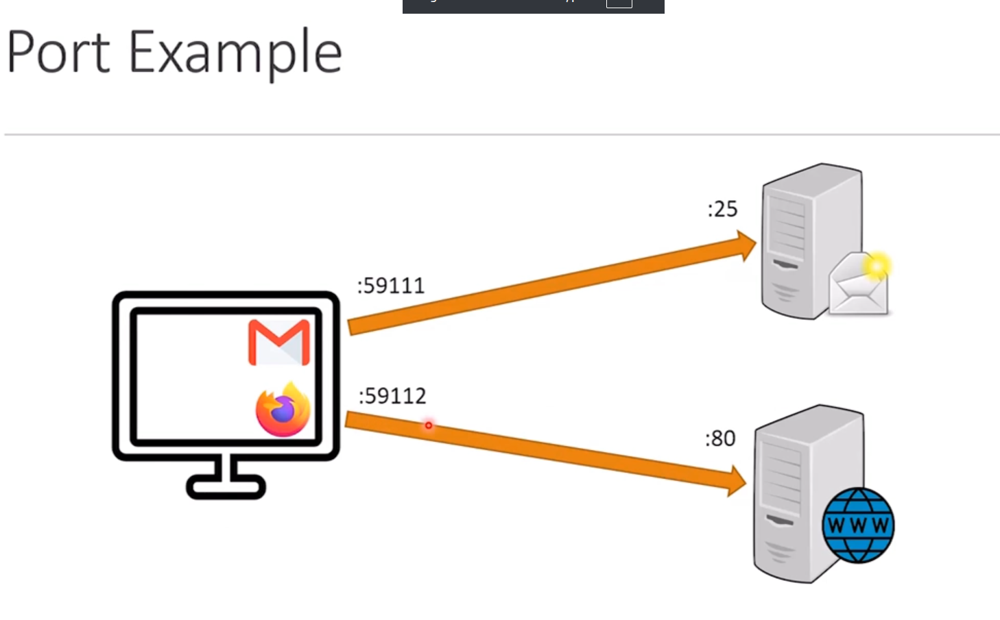

# Networking Overview

As you know, you can think(and also solve problems) in a field by mastering its base
concepts, structures, rules, and patterns. The networking concepts are introduced in
this modulo and in this lesson we're going to overview some of those. These concepts are
the tools for you to think in terms of `networking`.

## What is a Network?

When you connect to or more computing devices to each other, we have a network. There
are devices and connections, the devices(laptops, watches, TVs, fridges! etc) can be any
computing devices and the connections can be wired or wireless.

### Why Do We even Have a Network?

There are multiple reasons supporting the fact that we need networks:

- **Sharing data**.
- **Sharing resources**.
- **Remote communication**.
- **Distribute a computing workload**. Like the client and server model! You see, we are
  distributing some of the workloads to the server in this model.
  - Sensor - monitor.
  - Client - server.
  - Multiple facilities working together.

> A network also introduces us cost effectiveness and reliability.

## How Assets Communicate on the Network?

We need four things to make the communication on network happen:

- Two or more applications that want to talk to each other.
- A protocol which they use for talking. This is like a common language for the
  applications.
- Network interface. This is the applications and operating systems way to connect to a
  network.
- Transmission media. This is what physically makes the connections established in the
  network.

## Client/Server Model

This term represents a model which a device(called client) wants to get some services
that another device(called server) offers. Clients can be applications, physical
devices, etc. The server is usually a dedicated computer, listening on the network for
the client making the connection.

The networking perspective explains clients as the
`things that initiates the connection`. The server can accept or reject the client
connection attempt, usually based on the services the server provides, or some security
considerations.

A client or server can refer to a `device` or a `process`.

## Common Terminology

### IP Addresses

An IP address is a number that represents a node in the network. It is like a phone
number in the calling system(?).

IP addresses can change. You'll probably have different IP addresses in different
networks. You can also set your IP address, but most of the times we let the network
assign an IP address to our device.

Each network interface can have multiple IP addresses, but it usually has one IP
address. So our device can have multiple IP addresses, based on how many interfaces does
it have.

We have two main IP address versions: `IPv4` and `IPv6`. Check the *Fundamentals of
Internet Protocol* lesson in lpic1 notes I have covered both of these versions.

IP addresses can not be duplicate.

> Ip addresses are temporarily assigned to devices. Yes, you can force a device has a
> permanent IP address(can I?), but this is not the default expectation or behavior.

### MAC Addresses

Media Access Control Address or Burned in Address, is the address that manufacturer
burned into the network interface card when they created the interface.

This is the physical address. Think of it as a unique label for the device, and think of
an ip address as a unique label in the network.

The MAC address is per interface and can not change. Although the operating system can
override it, but after a reboot, the MAC address will be changed back at its previous
address.

> It is assigned by the NIC vendor. Think of it as the IMEI number for cell phones.

These are the examples of a MAC address: `BC-82-36-C5-D1-81`, `BC:82:36:C5:D1:81`,
`BC82.36C5.D181`.

They are also written in hexadecimal format. The first 6 numbers are similar for every
interface card a manufacturer produces.

### Source and Destination

The source is the node transmitting at the moment and the destination is the intended
recipient of the transmission at the moment. They can constantly switch. Think of a user
trying to get a web page. The user's browser is the source of the user's initial
request, and the server is the destination. When the server prepares the content that
user asked for it, it become a source and the user's socket(or device) will become the
destination. What is a socket? We will see.

### Protocols

Protocols are set of rules, defining how nodes or services in the network should
communicate to each other. They are languages that the nodes use to communicate with
each other.

> They can exist at any level of network. We have `SSH` protocol at layer 7, and ...?

### Port

A number that represents a process on the network. In the perspective of the operating
system, a `running application` is a process, but from the networking perspective, it is
a `port`.

We can classify ports in to three different ranges:

- **0-1023**: Used by well-known service(don't use them for random use cases).
- **1024-49151**: Registered by a service.
- **49152-65535**: Assigned to client applications.

> The port is assigned to process by the operating system, and two process can not share
> the same port on the same IP address.

### Socket

A using port called a socket. A combination of a protocol, IP address, and port creates
a socket.

This combination uniquely identifies a connection in the network. `TCP 192.168.1.1:80`
is an example of a socket.
