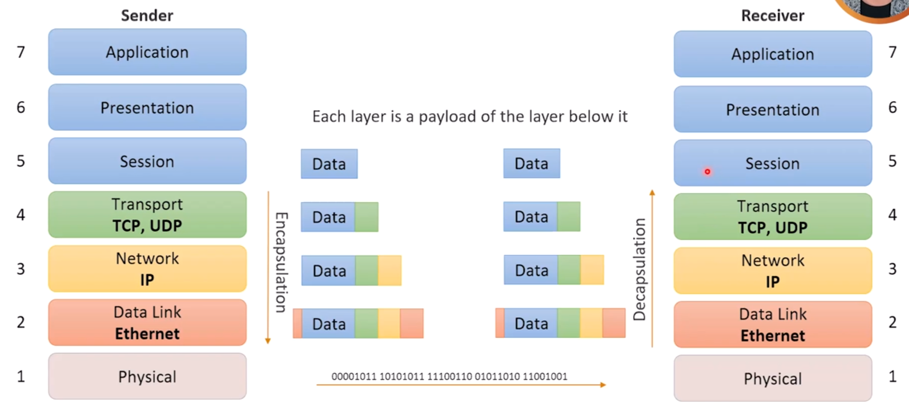
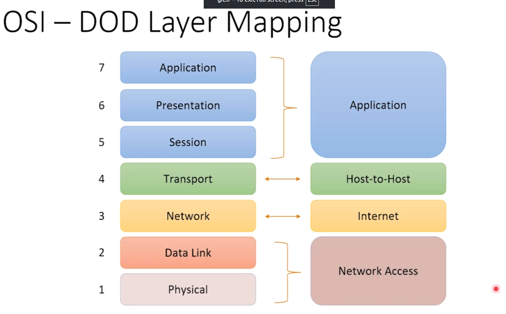
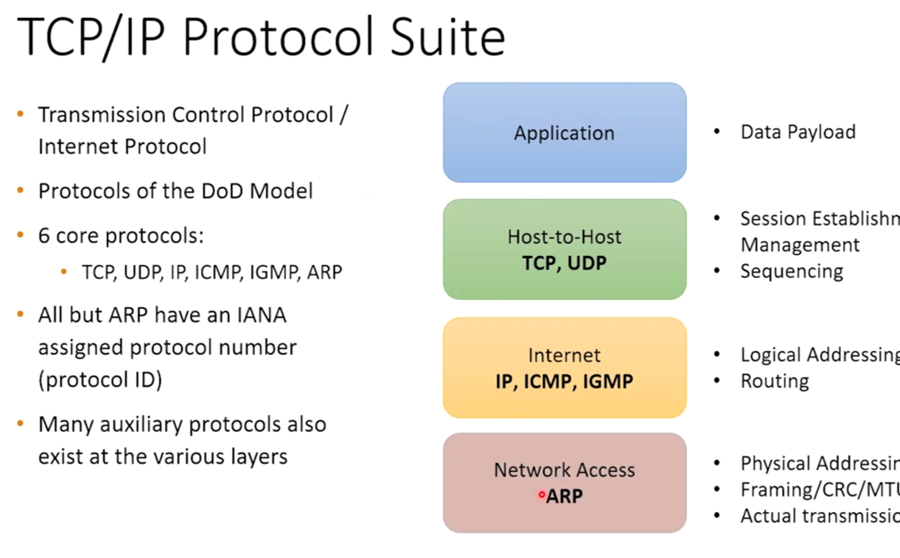
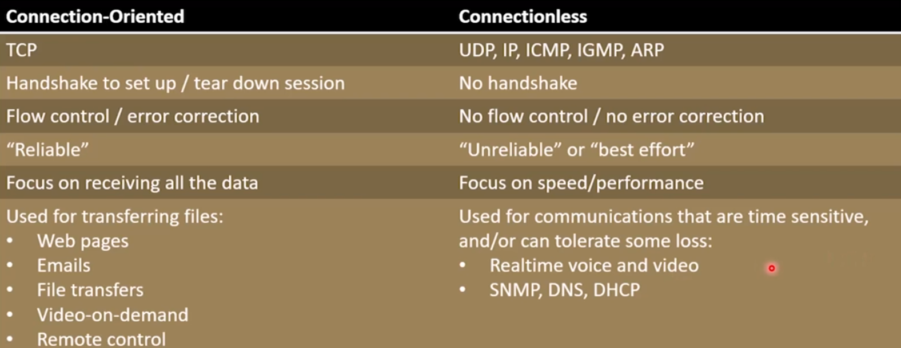

# OSI and DOD Model

## OSI Model

`Open System Internet Protocol` was introduced in the ate 70s. International standards
organization looked at networking and tried to came up with some set of rules and
standards, common in all networks. They came up with a seven layer model, called the OSI
model.

### Layer 7: Application Layer

This is like a *customer service counter* where the application requests to use the
network. Cisco called this layer user-interface layer too because this is commonly the
place that the user interacts with the network(opening a browser, sending an email,
etc).

At this layer, applications connect by speaking languages(protocols).

Common Layer seven protocols are: **SNMP, SMTP, HTTP, HTTPS, SSH, TelNet, NTP, SIP,
LDAP, FTP, TFTP, NFS, DHCP, DNS, RDP, IMAP4, POP3**.

Physical devices that operates at this level are **Firewalls** and **Proxies**.

> 🗂 At this layer, the data is called `data`.

### Layer 6: Presentation Layer

This is where both sides are going to agree on a common data format. As a user you may
or may not interact with this layer.

Common formats include:

- **Multimedia formats:** JPG, PNG, GIF, MP3, MP4, MKV, MOV, WAV, PDF, etc.
- **Encryption algorithms and bit sizes**: DES, AES, MD5, SHA-1, 160-bit, 128-bit, etc.
- **Compressions**: H.264, H.263, MPEG-4, MPEG-2, AAC, etc.
- **Character sets**: ASCII, Unicode, EBCDIC.

Physical device that operates at this level is **Firewalls**.

> 🗂 At this layer, the data is called `data`.

### Layer 5: Session Layer

This is the layer which keeps separate conversations, separate. It is the layer manages
which browser tabs to show the right web page received from the network. This is here
that the host as a concept of communicating with another host.

This layer is implemented usually by assigning ports to conversations.

Physical devices and service operating at this layer are: **Firewalls, packet filtering
routers, multi-layer switches, and SOCKS proxies.**

> 🗂 At this layer, the data is called `data`.

### Layer 4: Transport Layer

This layer acts as a pivotal layer, because it abstracts out the networking details from
of the three bottom layers to the top three layers. It abstracts the mechanical parts of
the networks from the higher layers.

This layer starts, manages, and teardown sessions. I want to see the session as the
communications established through the network.

This is the first layer that encapsulates data into its own header:
`source and destination ports`. This is the first layer that packages up the data.

**TCP and UDP that live in layer four. They are not the only one, but as far as we are
concerns, they are the protocols that operates at this layer.** Now the ports being
added to the data makes sense, TCP and UDP are about ports not IP or MAC addresses.

Physical devices at this level are: **Firewalls, packet filtering routers, and
multi-layer switches.**

> 🗂 At this layer, the TCP data is called `segment` and the UDP data is called
> `datagram`.

### Layer 3: Network Layer

This is where things get mechanical. At this layer, the TCP segments or UDP datagrams
will be encapsulated into IP packets. This layer will add logical addresses, usually the
source and destination IP addresses and find the best route for the packet to transmit.

This layer also adds its own header: `source and destination IP addresses`.

The three primary protocols that live here are: **IP, ICMP, and IGMP.**

Physical devices and service operating at this level are: **Routers, firewalls, and
multi-layer switches.**

> 🗂 At this layer, the data is called `packet`.

### Layer 2: Data Link Layer

This layer gets that IP packet ready to go on the network. It will encapsulate the IP
packet with physical addresses of the source and destination, usually the MAC address.
We have ethernet frame, PPP frame, HDLC frame, and if it is ethernet or wifi, it's gonna
have source and destination MAC addresses. This layer also formats the frame to be
suitable for the particular transmission media.

It adds a trailer to the packet, for the recipient to CRC check if the frame has got
corrupt or not.

From the destination point of view, the data link layer checks the frames for incoming
errors. It discards the frames that do not pass a simple cyclical redundancy
checks(CRC), but the decision to transmit back the data is upon the layer four. So it
just delete corrupt frames and hope somebody will notice it in the above layers.

This layer has two sub-layers:

- **Logical Link Control(LLC):** Describes layer three payload.
- **Media Access Control(MAC):** Adds the physical addresses,

All of the LAN and WAN protocols live here: **ARP, Ethernet, Token Ring, PPP, HDLC,
Frame Relay**.

The physical devices at this level are: **Switches, bridges, and multi-layer switches**.

> 🗂 At this layer, the data is called `frame`.

### Layer 1: Hardware Layer

This is where the data and headers are turned to bits and send through wires. Everything
that has to do with the electrical and mechanical aspect of transmission is at this
level. This includes **cable types, wiring types, wireless technologies, baseband,
broadband, modulation, speed, bandwidth, clock, voltages, frequencies, power levels,
etc**.

Physical devices at this level are: **Hubs, repeaters, patch panels, network card
interfaces, RJ-45, STP, UTP, thicknet/thinnet coax, CAT 3/5/5e/6/6a/7, fiber optic, Wifi
channels, wireless technologies, etc**.

> 🗂 At this layer there are only bits, 1s and 0s.

### Protocol Data Unit(PDU)

Congratulations, you have read the seven layers of the OSI model. Regardless of what
layer, the thing we called `data` in the layer's explanation are called PDU, a general
terms for different terms.

### Data Encapsulation/Decapsulation

Encapsulation refers to a concept of adding metadata to the data that is going to be
transmitted. Layer four, three, and two will add their headers. The layer two also adds
a trailer.

Decapsulation or De-Encapsulation refers to the concept of that the corresponding layers
remove and strip off the headers and then pass the PDU up. They refer to the information
in the header or trailer.

## DOD or TCP/IP Model

The Department of Defense(DOD) model or TCP/IP model was payed by the department of
defense of United States of America to be introduced by some universities. They asked
for a networking model to all of their locations around the country to communicate with
each other.

> TCP/IP model is a four layer model, and all its layers map to the OSI layers.

The TCP/IP specifically uses the TCP/IP suite of protocols.

### TCP/IP Protocol Suite

The TCP/IP model is built upon on six core protocols:

- **Host-to-Host**: TCP and UDP.
- **Internet**: IP, ICMP, and IGMP.
- **Network Access**: ARP.

They didn't bother to introduce some protocols as the core of the model for the
application layer, the main focus was on the internet and host-to-host layers. Beside
these core protocols, many auxiliary protocols exists at various layers.

> ⚠ All protocols except ARP have an IANA assigned protocol number(Protocol ID).

## Connection-Oriented and Connectionless Protocols

There is a key trade-off in the networking and software problems we should always
consider: **The reliability and performance tradeoff**.

Using this POV, let's jump into two concepts of networking, improving reliability or
performance.

### Connection-Oriented Protocols

These types of protocols attempt to ensure reliability and completeness. The use of
these protocols are determined by the purpose of their user. For example, you don't want
to miss any part of the movie you are downloading or you don't your data get lost if
you're doing a payment. **TCP is a connection-oriented protocol**.

TCP uses a handshake to create and end a session. TCP keeps track of the conversation.

When the connection establishes, the sender must make sure the that the other side is
responding:

- Are the packets getting acknowledged by the receiver?
- If the packets are not getting acknowledged, TCP will try to resend them.
  Acknowledgments and resends add overhead and slow down the conversation

On the other side, the receiver must response to the sender's requests. The receiver
should inform the sender how many packets it can receive at a time, and the sender will
slow down or speed up based on the `transmission rate`.

> ⭐ Connection-oriented protocols (TCP) are used when reliability is more important than
> speed.

### Connectionless Protocols

These types of protocols tries to speed up the conversation, rather to ensure
reliability. These suite of protocols doesn't attempt to ensure completeness of the
transmission. There are no handshakes, the protocols doesn't care if you're online or
not. These protocols assume that the lost packets are not important, so if they are
important, the higher level protocols should ask for resends themselves. **UDP is a
connectionless protocol**. IP, ICMP, IGMP, and ARP are all connectionless too.

