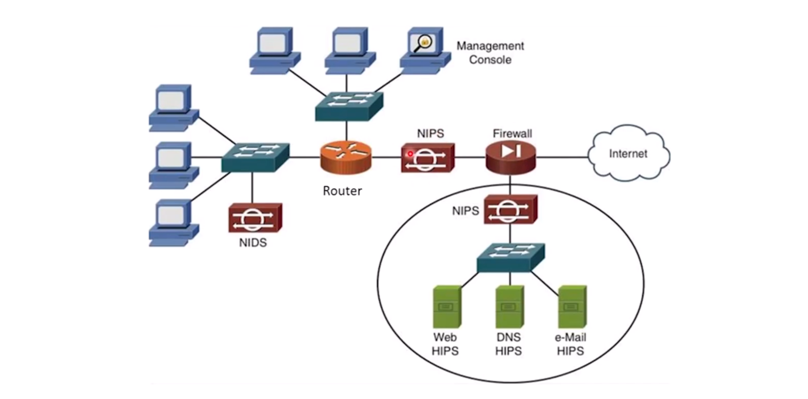
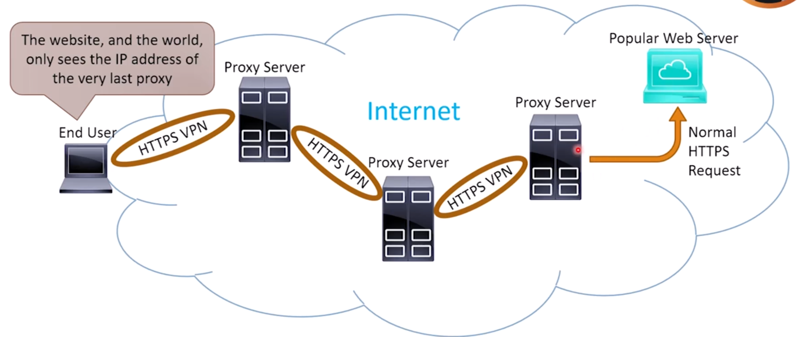
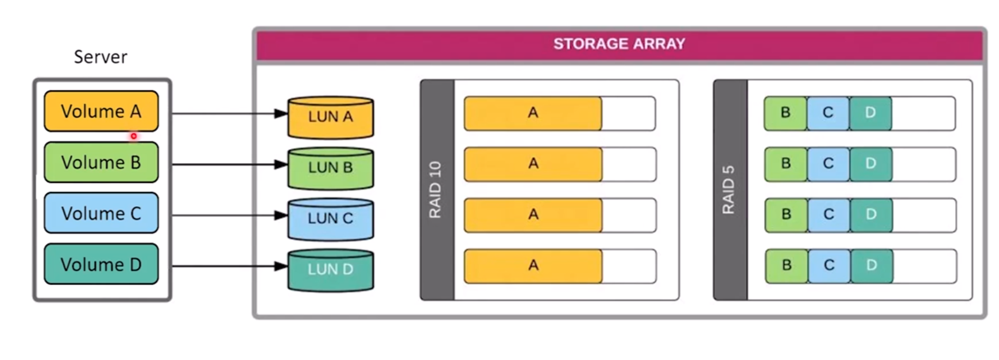
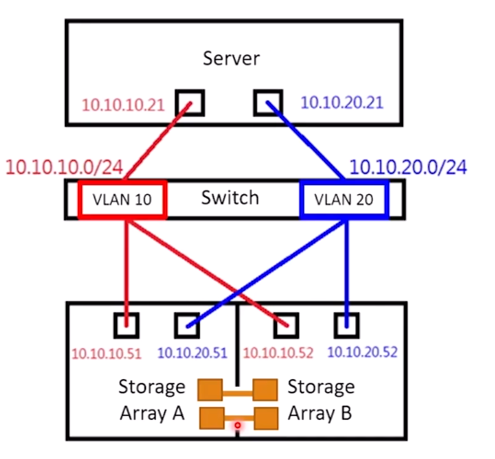

# Networking Appliances, Applications, and Functions

When we say appliances, we mean a device that is dedicated as opposed to some software
installed on a computer that's also doing other things.

## Physical and Virtual Appliances

### Routers

Routers are layer three appliances and their main use case is to make forwarding
decision and find the best routes.

They maintain a routing table which holds the best route to a destination. Routers can
also learn routes from other routers via routing protocol.

Since routers are layer three devices, they have different interfaces for a variety of
layer two types of media. Different interfaces allow the router to connects to different
types of layer two segments. Imagine this scenario: when a frame comes up from a layer
two media to the router, the router will check and based on the destination it decides
which interface should it send the frames/packets. If the frame is coming from a layer
two protocol and it is going to another protocol, the router will rip off the layer two
headers, put new ones that are appropriate for the media, and send it to the
transmission media. If it is going to send the frames to the same protocol, it just do
an `inline rewrite`, means it just rewrites the header, it doesn't need to rip the
header off and build another one just like it.

> 🌊 Routers can have built-in Wireless Access Points(WAP). Home routers also have a few
> built-in switch ports.

### Switch

Switches make forwarding decisions based on the physical/Layer two/MAC address. Most
switches are Ethernet switches nowadays. Switches has high port density.

Similar to routers, switches maintain an address table, but they maintain MAC addresses
instead of IP addresses. Switches have a `MAC addresses table` which stores MAC
addresses, facilitating the layer two routing. The switch will store the source's MAC
address in the MAC table like: Oh, MAC address blah blah blah is coming from this port,
let me save it. In a more technical explanation, switches consult the MAC table to
determine which ports to repeat a frame out of.

The switch will flood out broadcast, multicast, and unknown unicast out all ports,
unlike the routers which will drop a packet in this case.

> 🔀 A multi-layer switch can acts as a switch and a router. It operates at layer two and
> three. They have a router process running on it.

We can group ports together logically into VLens. Then, with a multi-layer switch, you
can also then, on the back plane of the switch, virtually, you can create default
gateways.

> ⛩ Old term for switch is `bridge`.

#### Ethernet

Ethernet is a family of technologies, defining the communication in a wired local area
network. It is a layer one and layer two technology. It defines cables, switches,
electrical/optical signaling, how devices identify each other(MAC), and the frame
format.

### Firewalls

Firewalls are routers with rules. It could be a software or a hardware. We have WAF in
front of our web applications. WAFs are the layer seven firewalls, so firewalls can
operate from level two to level seven. The main use case of firewalls are separating
untrusted network (usually the internet) and trusted network (usually our private
network). They can also block malicious traffic from the untrusted network. They do it
by forcing rules.

Firewalls often provides Network Address Translation(NAT) services.

> 💸 They might have subscriptions from the vendor. They can download malware signatures
> for deep packet inspection. This way, the firewall can recognize malicious codes and
> binaries.

### Intrusion Detection System(IDS)

The systems that analyze the network traffic for signatures that matches the cyber
attacks. They do not prevent anything but they send logs to dashboards and can alert
admins. The signature database can be outdated and it should get regular updates from
the vendor. Also, IDSes can not detect zero-day attacks. They can be network sensors or
softwares on a device. IDSes on the hosts plays strategically so they should place on
strategic hosts, like behind firewalls maybe?

We have two types of IDS: Network IDS(NIDS) and Host IDS(HIDS).

> 🐽 *Snort* is the one of the most famous open source IDSes.

### Intrusion Prevention System(IPS)

They are like IDS as they analyze packets and send their findings to a dashboard, BUT,
you should put IPSes in strategic locations, to act as a choke point and cut off
malicious traffic. This strategic location can be between the firewall and the rest of
the network.

Uses a signature database, but can also do statistical analysis to find out malicious
traffics that are not matched with any signature. Simply, it also can be configured to
watch anomalies.

IPSes can also be installed as a network appliance(NIPS) or as a software on a specific
host(HIPS).

There are some risks we should be aware of when using an IPS:

- They can produce false positives(system is configured to be too sensitive).
- They can produce false negatives.
- They can cut off new legitimate new protocols and traffic.

### Load Balancers

Load balancing is the process of distribution traffic among multiple servers. Load
balancers are the hardwares or software that do load balancing for us. They are used to
improve application's performance and reliability. So if one server is under attack or
it is down, other servers do their thing as usual.

### Proxy Servers

A service that fetches content from the internet(usually a web page) on behalf of the
client. The client is not allowed to make a connection on the internet, so the proxy put
the user session on hold, creates a new session, and transmit the data from the internet
into the private network.

They work at level seven and provide deep packet inspection. Usually they are placed
inside the local network, behind the firewall. Usually the users inside an organization
configure their proxy settings in their browser, to point to the proxy server of the
institution.

#### Reverse Proxies

*Nginx* is a famous reverse proxy. The reverse proxies fetches internal resource for
outside (internet) client.

#### Anonymizers

You are familiar with this type of proxies. Anonymizers are public proxies that users
use to hide their identity or bypass their local restrictions. This is the types of
proxies which attempts to ensure privacy. They keep your identity private in cost of
some amount of speed.

### Network Attached Storage(NAS)

A dedicated standalone file server appliance (usually running Linux) on the private
network. It can accept file requests from clients using various protocols(SMB, NFS,
HTTPS, S/FTP, etc). It doesn't do anything else rather than storing and sharing files.
It typically has a built-in RAID array.

### Storage Area Network(SAN)

An entire dedicated, specialized network dedicated to high-speed storage. They designed
to scale easily and offer redundancy features like multi-pathing and failover to ensure
high availability.

Instead of servers having their own internal disk, they make a network connection to one
part of a larger disk array (storage array). The storage array has a controller that
connects it to the network.

Multiple servers can access the same storage array, and the storage array is divided
into Logical Unit Numbers(LUNs), the servers can store one or more LUNs to store the
files on it, and the servers treats LUNs as they are directly attached to the local
disk.

Common SAN protocol includes: **Fiber Channel(FC), iSCSI(internal Small Computer System
Interface), and Fiber Channel over the Ethernet(FCoE)**.

When you create a logical unit number on the SAN, the controller doesn't make the whole
unit on a single disk, instead it spread it across multiple the disks. The controller do
all of the fault tolerance, the server doesn't need to know about the details of the
storage structure. As far as the server is concerns, there are just raw disks (LUNs at
the point of view of the controller) that it could partition, format, and put files on
it, by making a connection across the network. That's great example of separation of
concerns.

#### iSCSI

One of the reasonable ways to connect to a Storage Area Network is using iSCSI.

SCSI is an interface type to for talking to discs, CDs, DVDs, or other kind of storages.
SCSI introduces set of commands that we can send them as IP payloads, and that's all
iSCSI is about.

iSCSI let SCSI commands sent across network through TCP 3260 payloads. Server OS should
have iSCSI initiators, and then initiators could be:

- Can be software based in the OS.
- Can be hardware based in the NIC.

Once the iSCSI initiators establishes a connection with the storage array, the host will
see the LUNs as local disks.

### Wireless Access Points (WAP)

Wireless Access Points acts as a bridge between wired and wireless networks. They allow
wireless devices connects to a wired network.

### Access Point Modes(AP Modes)

There are **Standalone WAPs**, **Controller-based APs**,

- **Standalone APs**: Independent, one AP with one SSID.s
- **Controller-based APs**: This is where enterprise level access points comes in to
  play. This type of APs are controlled by a central controller connected to all of the
  LAPs.
- **Cloud-manages APS**: Managed APs not by on-premise controllers, but from the cloud.
  Suitable when you have sites in different locations and you want to manage them
  remotely.
- **Mesh**: Multiple APs are part of one SSID. Suitable for large cover areas.

### Wireless LAN Controller(WLC)

These devices are used to manage multiple WAPs. They can be a standalone device,
built-in to switches, or a cloud service.

WAPs communicate with WLCs via VPN on LAN. WLCs centrally control the configuration of
their WAPs, dynamically load balancing traffic across the WAPs based on the client load,
radio interface, and network conditions.

### Wireless Range Extender

This is just a repeat, it connects wirelessly to a WAP or Wi-Fi capable router. The
extender connects wirelessly to your existing WAP (which could be a standalone WAP or a
Wi-Fi router ) and rebroadcast the signal, effectively extending the coverage area.

## Content Delivery Network(CDN)

CDNs are distributed networks of servers strategically place around the glob. They
deliver web content and services quickly and efficiently to nearby end users. CDNs:

- Cache and distribute content on edge servers close to end users.
  - Usually the contents that are not changed a lot, they are changed daily, weekly, or
    monthly.
  - Reduce latency and improve load times.
- Improve availability and reliability.
  - Mitigates DDOS attacks and provide redundancy.
  - Ensure web services remain available during high traffic or localized outages.
- Provide security features. They have built-in WAFs, SSL/TLS encryption, and protection
  against common attacks.

## Additional Devices Functionality
