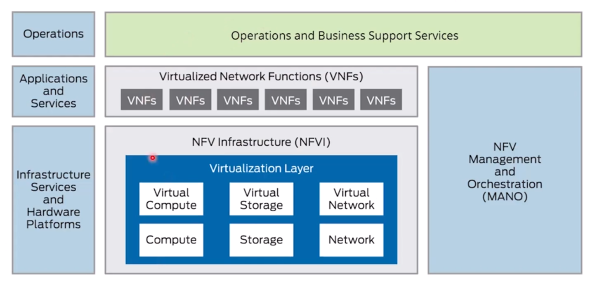
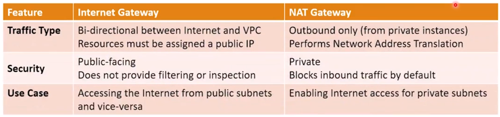
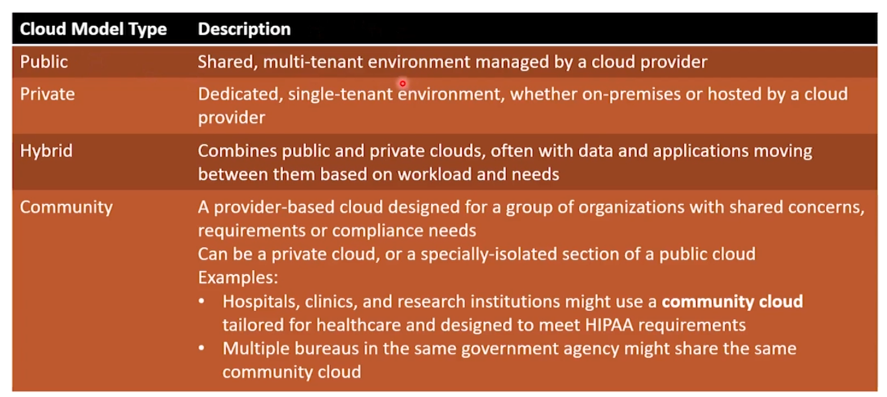
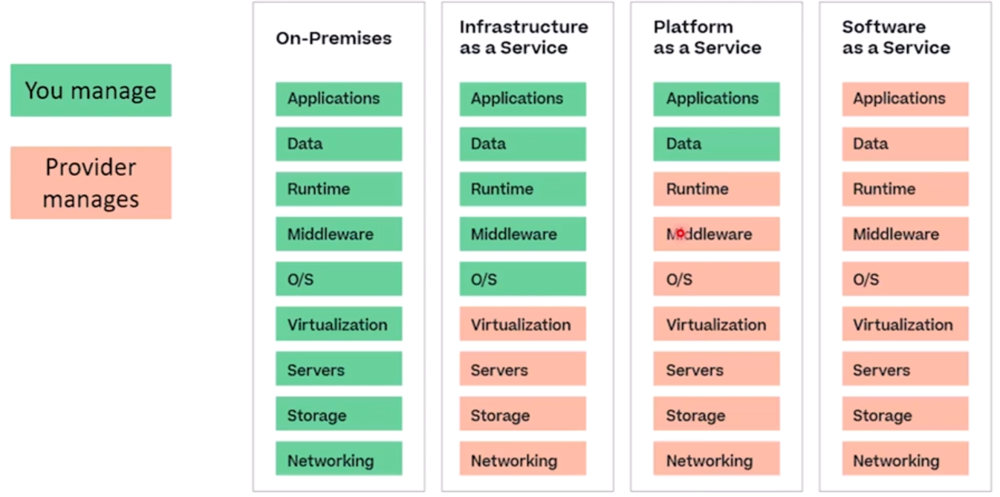

# Cloud Concepts and Connectivity

## Network Function Virtualization(NFV)

The act of taking functionality of a network, breaking it into component parts (routing,
switching, firewalls, load balancers, connections, etc) and implementing them into
softwares instead of hardwares.

Each function is its own little program(Virtual Network Function or VNF) and VNFs are
chained together to perform all the tasks we expect from a network, so they could do
network function virtualization.

NFV has become the de facto approach for delivering cloud-based (IaaS) network services.
Customer-facing cloud features run on top of this infrastructure and to the customer,
the virtualized network appears and mostly behave like a remote physical network, but in
reality, there are some programs running on virtual machines in the cloud provider's
data center.

## Virtual Private Cloud(VPC)

A Virtual Private Cloud(VPC) is a secure, isolated environment within a public cloud
that allow users to perform tasks that would normally require a traditional data center.
In a VPC you can create your own private IP address space, subnets, routing tables,
network gateways, servers, services, etc. These are some features of VPCs:

- Isolated network environment: Yes the infrastructure is in someone else's data center
  but you can treat it as a secure, isolated section of the cloud provider's
  infrastructure where users can run resources.
- Customizable network configuration: You can define your IP address range, subnets,
  route tables, network gateways, etc.
- Security features: It offers network access control lists, security groups, and it
  will protect your traffic and data with VPN connection.
- Scalability and flexibility: The users can easily add, remove, or scale resources
  based on their needs.
- Direct connectivity options: Supports private connectivity options like VPNs or Direct
  Connections for secure access to on-premise data centers.
- Cost-efficiency: You don't need to maintain and buy the actual hardwares. VPCs
  eliminates the need for dedicated hardware while providing the benefits of a private,
  secure network environment in the cloud.

## Network Security Lists

Network Security Lists are a type of access control list for cloud networking. They are
equivalents to Network ACLs in traditional networking. They define rules to allow or
deny traffics to and from specific resources in a virtual network. They are applied at
the subnet or VPC level, and they are often used to control the traffic at the subnet
level within a Virtual Private Cloud(VPC), determining which traffic can enter or leave
the subnet.

Like all the firewall rules, it can be stateless(without tracking the session) or
stateful( tracking session information for automatic responses).

## Network Security Group(NSG)

This is the way Azure implements Network Security Lists(network traffic filtering). In
AWS, NSGs are called **Security Groups**. In GCP(Google Cloud Computing), they are
simply called Firewall Rules.

## Cloud Gateways

Cloud gateways are network components that provide connectivity between cloud resources
to the external networks (the internet). Two common cloud gateways are Internet
Gateways(router) and NAT Gateways (NAT). They are choke points between the cloud
infrastructure and the rest of the world. They enable secure and efficient data
transfer.

## What are the Cloud Connectivity Options?

There are three common methods to connect to the cloud:

- Use the browser (public internet).
- Use a VPN.
  - An office uses its internet router to create site-to-site VPN with the cloud-based
    VPN server.
  - Individuals can also connect to the VPN server of the cloud provider by using their
    own VPN client.
- Use Direct Connection.
  - Dedicated physical link to a cloud environment.
  - Cloud providers partner with telcos, offering dedicated link as service.
  - A telco can pull a new link to the office.
  - **Typically unencrypted.**

## Cloud Deployment Models

## Cloud Service Models

A cloud service models are ways that the cloud services are provided for the customers.
They define the level of control, management, and responsibility shared between the
cloud provider and the customer.

### IaaS(Infrastructure as a Service)

This is where the cloud provider just ensures that the physical appliances are
well-maintained and you have to do all the other works. You have to secure, design and
build all these networks, subnets, load balancers, gateways, switchers, etc.

### PaaS(Platform as a Service)

This is level above the Iaas in the cloud stack. Mostly, this is an operating system
plus tools for developers to build their solutions and applications on it. See it as a
development environment.

### SaaS(Software as a Service)

Allow users to connect to the same application using their local ISP. The provider sets
up the software including security. The customer adds user and data. Think of the
browser version of the microsoft office word.

> 🏭 If I am a company that wants to create an application which be available for
> internal and third-party users, I will built my application in PaaS, and I will make
> it available in SaaS.

## Cloud Scalability

This is the key feature of cloud computing and one of the main reasons the organizations
are choosing cloud solutions instead of on-premise solutions.

**What is scalability?** Scalability refers to a system's ability to handle increasing
workload, data volume, or user traffic without a drop in performance or a complete
redesign.

Scalability is provided easily on the cloud. When you need more resources to handle the
concurrent users on your website, you need to buy servers and install operating systems
and do a lot of work. In the cloud, this is reached just by adding another VM with more
RAM and CPU to your environment and voila, you can now handle your users.

High scalability in the cloud allows resource to be adjusted based on the demand.

### Vertical Scaling

In vertical scaling, you increase or decrease the capacity of existing instances. You
**scale up or scale down**. It is great when a server needs power to handle increased
loads, like a redis server that wants more memory to store data.

### Horizontal Scaling

In horizontal scaling, you add or remove more instances to handle the load and
distribute the workload across these instances. You **scale in or scale out**. Load
balancing scenarios are great ways to think of horizontal scaling.

## Elasticity

A type of real-time auto-scaling. Elasticity refers to the ability of a cloud
environment to very quickly and automatically expand or contract resources in real-time
based on the demand. Elasticity of a cloud environment provides on-demand resource
allocation without manual intervention.

This ability, maximizes the efficiency and cost and minimizes waste by allocating the
resources that the customer needs at a time.

Use cases can vary from an e-commerce website that are going to go through black friday,
from video streaming services that are going to host a popular show for a week, to
unpredictable applications that their user traffic will spark up and down.

## Multitenancy

Tenant means a customer. This is a key architectural feature of cloud computing.
Multitenancy refers to the ability of cloud providers (which they must have!), to
separate multiple tenants on the same physical resources.

The answer to the question that "Why do we have such a thing?" is kinda clear now but
let break it down using our historical thinking. Years ago, people noticed something on
their servers, that the servers are utilized just by 7%. No matter what the utilization
of our servers, they are keeping the same ground floor, using electricity, and needs to
be cool. So engineers came up with the idea of having multiple virtualized computers
inside a single physical server, to maximize the server's utilization.

In cloud environments, tenants should be isolated from each other, ensuring that a
tenant's data is not accessible from other tenants. This isolation is brought by
encryption, access controls, and secure data partitioning.

Multiple customers (tenants) share the same computing resources, such as servers,
storages, and applications in the cloud environment. They are isolated logically.
