# Ports, Protocols, Services, and Traffic Types

## Ports and Protocols

Yes, I need to know all the ports and protocols.

### Application Layer Protocols

| Protocol                                              | Port(s)       | Description                                                                                                                 |
| ----------------------------------------------------- | ------------- | --------------------------------------------------------------------------------------------------------------------------- |
| File Transfer Protocol(FTP)                           | TCP 20, 21    | Transfer files in clear text between a client and server.                                                                   |
| Secure Shell(SSH)                                     | TCP 22        | Securely access and manage remote systems over an encrypted connection.                                                     |
| Secure File Transfer Protocol(SFTP)                   | TCP 22        | Transfer files over an encrypted connection using SSH.                                                                      |
| Telnet                                                | TCP 23        | Unencrypted text-based remote control protocol.                                                                             |
| Simple Mail Transfer Protocol(SMTP)                   | TCP 25        | For sending email, client-to-server or server-to-server.                                                                    |
| Domain Name System(DNS)                               | TCP, UDP 53   | A hierarchial protocol that translates human readable domain names into IP addresses.                                       |
| Dynamic Host Configuration Protocol(DHCP)             | UDP 67, 68    | Automatically assigns IP addresses and other network configuration settings to a device on the network.                     |
| Trivial File Transfer Protocol(TFTP)                  | UDP 69        | A simple, lightweight protocol used for transferring files without authentication.                                          |
| Hyper Text Transfer Protocol(HTTP)                    | TCP 80        | For transmitting hypertext(web pages) between a client(browser) and a server.                                               |
| Network Time Protocol(NTP)                            | UDP 123       | Used to synchronize the clocks for computers and other devices over a network to precise time reference.                    |
| Simple Network Management Protocol(SNMP)              | UDP 161, 162  | Used to centrally manage, monitor, and configure devices over a network.                                                    |
| Lightweight Directory Access Protocol(LDAP)           | TCP 389       | Used to manage and access directory services data.                                                                          |
| Hyper Text Transfer Protocol Secure(HTTPS)            | TCP 443       | SSL/TLS encrypted version of HTTP, making a secure connection to a website.                                                 |
| Server Message Block(SMB)                             | TCP 445       | File and print sharing protocol of Windows systems.                                                                         |
| Syslog                                                | UDP 514       | Standard protocol for logging system messages and events to a centralized server.                                           |
| Simple Mail Transfer Protocol Secure(SMTPS)           | TCP 587       | TLS/SSL encrypted version of SMTP, which sends emails securely.                                                             |
| Lightweight Directory Access Protocol Over SSL(LDAPS) | TCP 636       | TLS/SSL encrypted version of LDAP, making a secure connection to a directory services.                                      |
| Structured Query Language(SQL) Server                 | TCP 1433      | Standardized language to query, manipulate, and manage data in relational databases(SQL Server here).                       |
| Remote Desktop Protocol(RDP)                          | TCP 3389      | Microsoft proprietary protocol for GUI-based remote control of another computer.                                            |
| Session Initiation Protocol(SIP)                      | TCP 5060/5061 | Signaling protocol used to initiate, manage, tear down voice, video, and messaging communication sessions over IP networks. |

## TCP, UDP, IP

### Transmission Control Protocol(TCP)

A host-to-host (layer 4) protocol with these characteristics:

- It's a payload of IP(**?**).
- Embeds source and destination ports in its headers.
- Provides reliable, connection-oriented communications over IP networks between two
  endpoints.
- Attempts to guaranty delivery.
- Divides data into segments(TCP segments). -> Send large data over the network. It
  sends few segments at the time and wait for acknowledgments.
- The node that is receiving the TCP segments has something called the receive window.
  It is basically a buffer of how much RAM my operating system has been given me so I
  can get X number of segments in, before I have to wait and offload them into my
  operating system. So more technically, **The receiver uses a receive window (sliding
  window) which tells the sender how big the receiver's buffer is from segment to
  segment.**

> ☂ It makes sure that every bits of the data on the network is delivered successfully
> with no chunks missing.

#### How Does it Work?

A session establishes by a three-way handshake: **SYN, SYN-ACK, and ACK**. The client
ALWAYS initiates the connection, that's the definition of a client.

> 💡 The idea is to acknowledge the things the receiver receives. This is one of the
> mechanism that TCP tries to be reliability.

The session is closed by a four-way handshake: **FIN, ACK, FIN, ACK**. It can be done by
either sides.

TCP has the Protocol ID of 6.

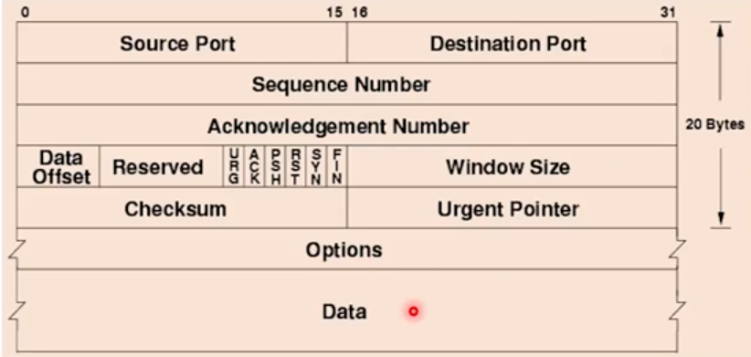

#### TCP Flag

A TCP flag indicates the purpose of the TCP segment. Every TCP segment has at least one
flag raised.

| Flag | Description                                                                                        |
| ---- | -------------------------------------------------------------------------------------------------- |
| SYN  | Synchronize: Used in three-way handshake to start conversation.                                    |
| ACK  | Acknowledge: All TCP segments except the very first SYN will have this flag.                       |
| URG  | Urgent: Tells receiver to prioritize this data.                                                    |
| PSH  | Push: Tells receiver to send this data directly to the application(do not store it in the buffer). |
| RST  | Push: Tells receiver that the sender has abruptly ended the conversation.                          |
| FIN  | Finish: Used in four-way handshake to end the conversation.                                        |

> 🔚 `RST` flag is send to the client usually when there are no service running on the
> specified port.

### User Datagram Protocol(UDP)

TCP's little brother, a host-to-host/transport layer protocol (layer four) with these
characteristics:

- It is connectionless.
- It is not reliable and it is best effort. Reliable doesn't mean you can not count on
  it, it just means there are no session establishment or SYN and ACK. **So no
  handshakes.**
- It is a payload of IP.
- It embeds the source and destination ports in this header.
- This protocol send short packets of data, called `datagram`.
- It is ideal for applications that latency is critical but not loss: gaming, real-time
  voice and video, SNMP and DNS queries and DHCP.

> 🧮 The applications are responsible for handling the loss.

The Protocol ID of it is 17.

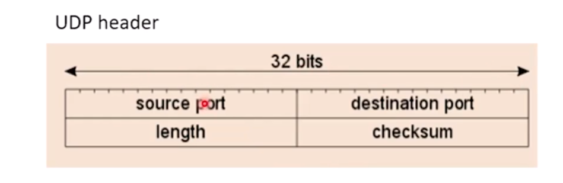

### Internet Protocol(IP)

A internet (network) layer protocol with these characteristics:

- It is connectionless.
- It can be a payload of practically any link layer protocol.

The Protocol ID number of it is 4.

We have two main versions of IP:

- IPv4:
  - Still most widely used(at the time of writing these notes).
  - Uses 32-bit logical addressing to identify source and destination hosts.
  - Examples: 127.0.0.1, 50.50.50.25, 192.168.64.64
- IPv6:
  - Allows longer addressing and vast improvements over IPv6.
  - Steadily gaining popularity.
  - The IPv6 addresses contains 128 bits.
  - Examples: 2001:0db8:0a0b:12f0:0000:0000:0000:000, ...

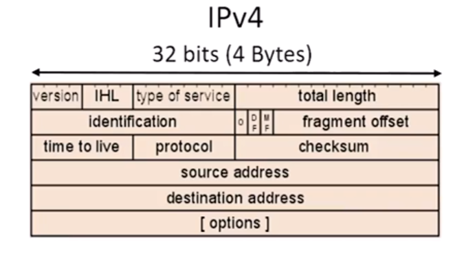 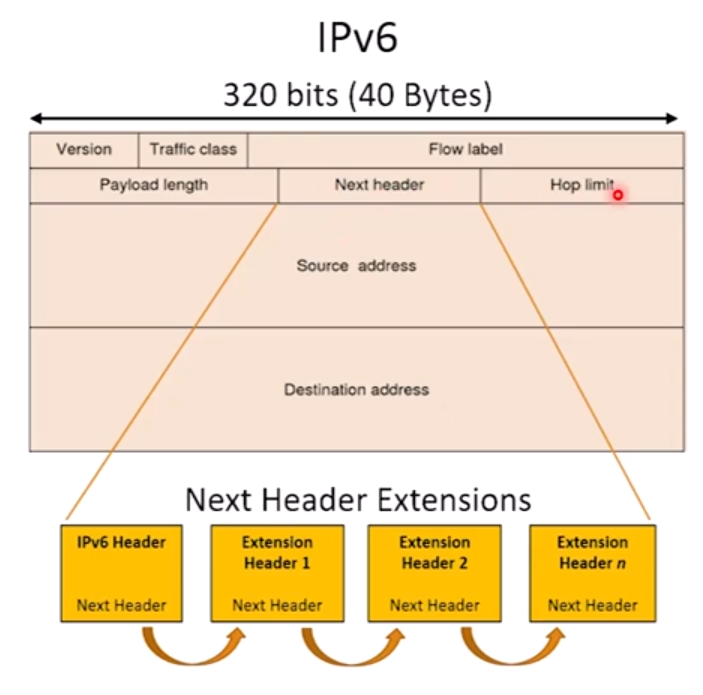

## ICMP, IGMP, ARP

### Internet Control Message Protocol(ICMP)

This is an internet (network) layer three protocol with payload of IPv4 and IPv6 which
is used by network devices to generate error messages and manage traffic flows. So, it
is an error-reporting protocol. Any IP network device can send and receive ICMP
messages. It has Protocol ID number 1!

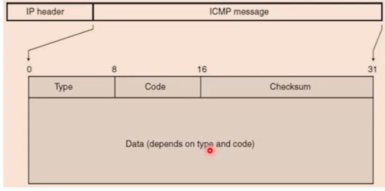

ICMP has message types and codes that describes the purpose or general category of the
message. It is not necessary to memorize all of the codes and types but here are few
ones:

| ICMP Type               | Type Number | Codes and Descriptions                                                                                                                                            |
| ----------------------- | ----------- | ----------------------------------------------------------------------------------------------------------------------------------------------------------------- |
| Echo (request)          | 8           | Code 0: No additional information.                                                                                                                                |
| Echo Reply              | 0           | Code 0: No additional information.                                                                                                                                |
| Destination Unreachable | 3           | Code 0: Network unreachable Code 1: Host unreachable Code 2: Protocol unreachable. Code 3: Port unreachable. IGMP                                        |
| Redirect                | 5           | Code 0: Redirect for network Code 1: Redirect for host. Code 2: Redirect for type of service and network. Code 3: Redirect for type of service and host. |
| Time Exceed             | 11          | Code 0: TTL expired in transit. Code 1: Fragment reassembly time exceed.                                                                                       |

#### ICMP Applications

- **ping**: An application which proves layer three connectivity. I am proving that I
  can send a packet to you and you can send a packet to me.
- **traceroute**: A progressive series of either ICMP echo requests or UDP datagrams.
  Study more about traceroute at
  [101.3](101.3_networking-appliances-applications-and-functions.md).

### Internet Group Management Protocol(IGMP)

Used by hosts to notify routers that they still interested in receiving multicasts from
upstream servers. **Routers do not forward multicasts by default, which make the hosts
notify routers that they still want the multicasts.** It has Protocol ID number 2.

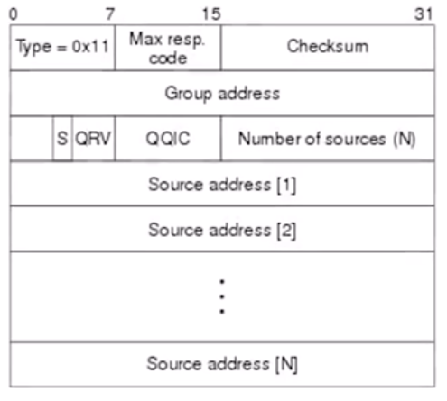

#### IGMP Operation

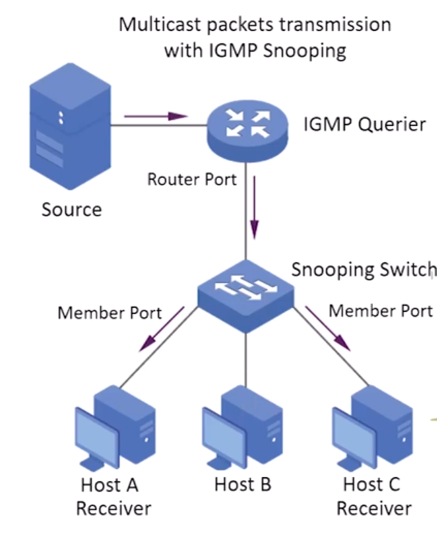
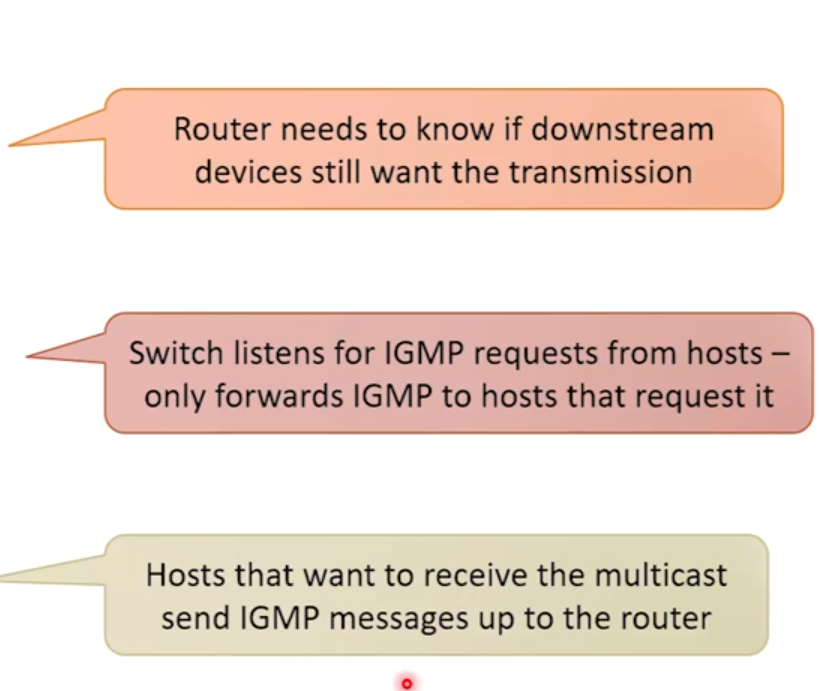

### Address Resolution Protocol(ARP)

A device can not send a packet out on an ethernet network unless it has both source and
destination: **MAC addresses, IP addresses, port**. It is a layer two connectionless
protocol, used to discover MAC addresses based on IP addresses.

**How does it work?** A device that needs to know the destination's MAC address send a
layer two broadcast (FFFFFFFFFF) and query all listing nodes and request which device is
using the specified IP address to find the MAC address. Mappings are stored in device's
ARP cache for 2-10 minutes. This protocol has no Protocol ID.

> 🥛 It is used in Wi-Fi and Ethernet networks.

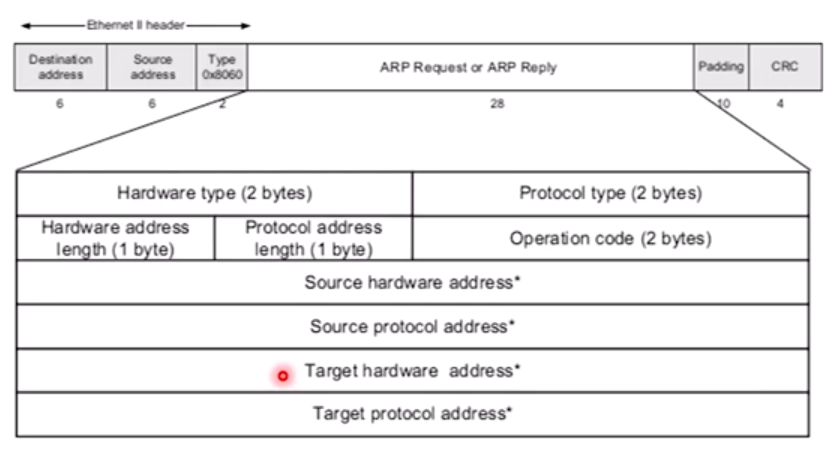

## Tunneling

The act of hiding a packet inside of a packet is called `Tunneling`. Sometimes only the
data is hidden and sometimes an entire packet is hidden. You can hide anything you want
inside of another packet, like malicious code.

The original packet becomes the payload of the outside packet. The inside envelope may
or may not be encrypted, but in VPN cases there are usually encrypted. When the packet
reaches its destination, the outer packet is stripped off and discarded. So, what are
the tunneling use cases?

- **Secure data transfer across public network.**
- **Provide secure remote access to internal network resources.**
- **Bypass firewalls, content filters, and other network restrictions.**
- **Hide my identity, location, and IP address.**
- **Transmit incompatible protocols over a network that does not support them
  natively.** This is the use case when the tunneling is not encrypted.

### What is VPN?

A VPN is an encrypted, secure tunnel between a user's device and a remote server. The
tunnel is series of outer packets that carries the original packet as payload.

> 🔒 Hiding the original packet inside masks the user's IP address and ensures privacy on
> the internet.

VPNs allow remote users to securely access a private network. We have these common types
of VPNs:

- **Remote Access VPNs**: For individuals connecting to a specific computer.
- **Site-to-Site VPNs**: For connecting multiple networks across the internet.
- **Client-to-Site VPNs**: For accessing an entire private network from a single client
  device.

### General Routing Encapsulation(GRE)

GRE is a tunneling protocol developed by Cisco. It encapsulates a wide variety of
network layer protocols inside point-to-point connections. The encapsulated (inner)
packets can be IPv4, IPv6, multicast, and even non-IP protocols, but the outer packets
are either IPv4 or IPv6 protocols. Data is encapsulated and transmitted over the public
network.

GRE by itself doesn't encrypt, authenticate, or do flow control. It is meant to be a
transport mechanism for protocols that the network might not otherwise be able to carry.

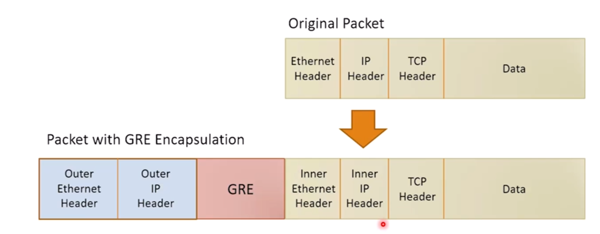

### IP Security(IPSEC)

The most common type of VPN (tunneling protocol). It is used for remote access and
site-to-site VPNs. It consists of two protocols:

- **Authentication Header(AH)**: Protocol ID 51.
- **Encapsulating Security Payload(ESP)**: Protocol ID 50.

We use one or both as desired. Most implementations just use ESP.

IPSEC has two modes: **Tunnel and Transport modes**.

When two sides try to create an IPSEC VPN, they will turn to some friends: **ISAKMP and
IKE** to negotiate the session. They ensure secure public key exchange and agree on how
the traffic will be encrypted and decrypted.

#### Authentication Header(AH)

If we use AH alone, it just digitally signs the IP packet. So basically it validates the
integrity and authenticity of the packet. It calculates the HMAC hash over the payload
and most of the IP header.

> 🔓 The payload is not encrypted. So it can not tolerate NAT, because that address
> translation will break the hash.

When we use AH with ESP, we're adding an extra layer of security to our tunnel.

#### Encapsulating Security Payload(ESP)

This protocol encrypts the payload and it will digitally sign the TCP or UDP header and
data. It doesn't modify the layer three header. It is used to protect the
confidentiality and integrity of the payload. Most common implementations of
site-to-site IPSEC VPNs uses this protocol.

By itself it can not tolerate NAT, but NAT Traversal(NAT/T) is a variant of ESP that can
tolerate NAT. In NAT/T, the entire packet of ESP is encapsulated in a UDP datagram and
as a payload of UDP, it is unaffected by any NAT changes applied to layer three or layer
four headers.

#### ISAKMP and IKE

These are the protocols that IPSEC actually uses to setup the VPN between two per
devices. A peer device can be a router, firewall, VPN server, host, etc.

Internet Security Association and Key Management Protocol(ISAKMP) is a framework for
creating `Security Associations(SA)` between routers. SAs defines the policy and
cryptographic parameters for communication over IPSEC. You must have two SAs, one in
each direction, between the devices.

Internet Key Exchange(IKE) is a protocol that uses ISAKMP to negotiate and establish a
secure communication. It uses the *Diffie-Hellman algorithm* to exchange keys and
negotiating cryptographic parameters.

#### IPSEC Transport Mode

Remember that we said IPSEC has two modes? This is where I explain transport mode. The
transport mode is used to create host-to-host VPNs. There is no tunneling here, the
packets are not encapsulated in another packet, the two hosts creates a VPN directly
between them. Hosts have to be able to route traffic to each other, the infrastructure
should allow it.

The use cases of transport mode are mostly in client-to-server or server-to-server
connections. Transport mode can introduce extra security between hosts in a private
network(think of server replication), or it can secure connections between hosts in
different security zones(Think of a web server in DMZ trying to connect to a database
server in a private network). Client-to-server connections across the internet are also
another scenario of transport mode use case.

#### IPSEC Tunnel Mode

We have tunneling in this mode! The packets are wrapped inside of another packet. This
mode is used to create site-to-site VPNs. Typically, two edge devices (routers or
firewalls) creates this kind of IPSEC mode between them over the internet.

The client traffic between two networks flows through the VPN. Client traffic is only
encrypted when in the tunnel, and the clients are unaware that the connection is VPN. It
allows subnets with private IP addresses to connect to each other.

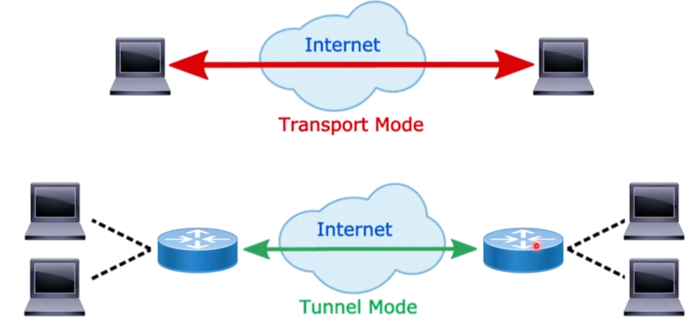

The below pictures are packet structure of different IPSEC modes, the top structure is
for AH and the bottom one is for ESP. First picture is for the transport mode and the
second picture is for the tunnel mode.

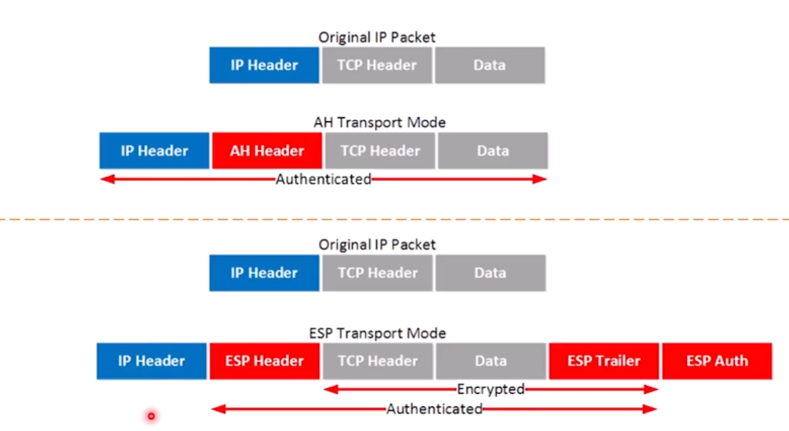
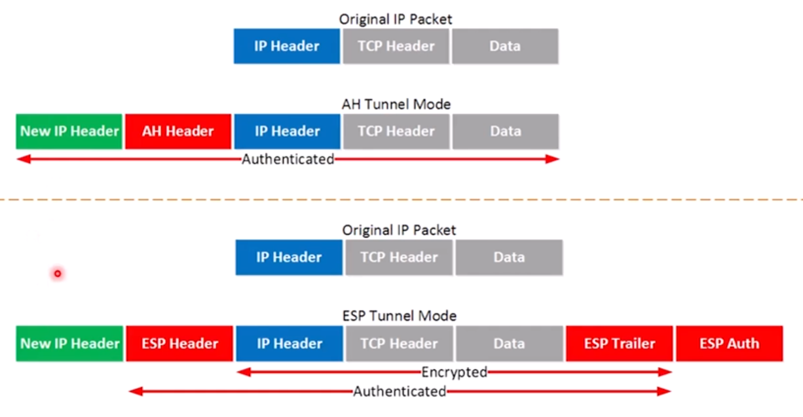

> 🕴 Tunneling is typically including a private IP packet hide inside a public IP packet.

## Traffic Types

### Unicast, Multicast, Broadcast

When a node transmits a packet on the network, depending on the destination address, one
or more nodes would be the recipient. **Unicast is one-to-one, multicast is one-to-some,
and broadcast is one-to-all**. Ipv6 introduces us a special traffic type called
**Anycast**.

#### Anycast

A special type of unicast used in IPv6. In this type, multiple servers has the same IPv6
address and the router sends the packets to geographically closest server. This tends to
reduce the latency for end-users and brings the servers closer to the them. The
applications on anycast traffic type are:

- **Content Delivery Networks**.
- **Public DNS**.
- **Public Time Servers**.
- **Global Load Balancing**.
- **Email/Antispam Services**.
- **DDOS Mitigation Services**.
