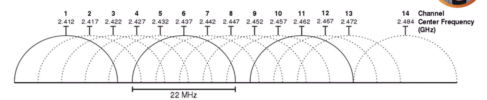
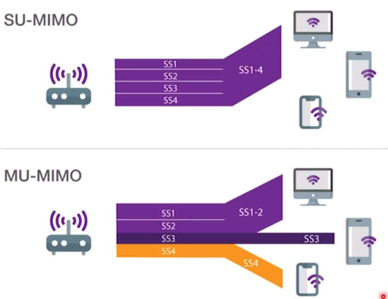
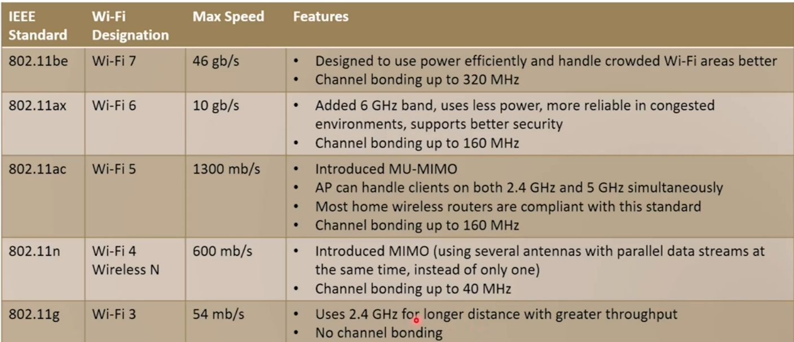
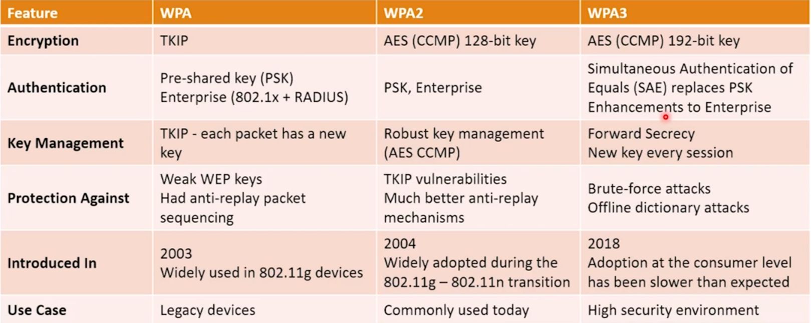
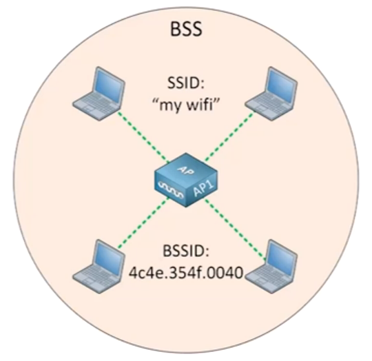
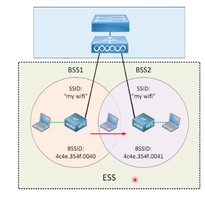
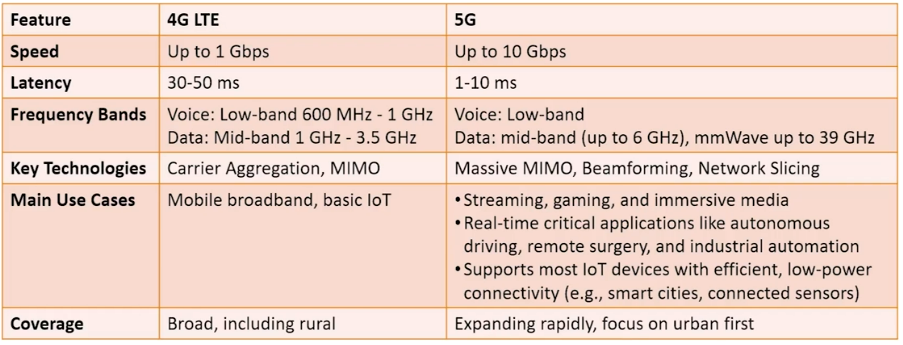

# Wireless and Transmission Media

## Wi-Fi

### What is Wi-Fi?

If you plug-in an ethernet cable, the data will travel as electrical signals through
through copper. With Wi-Fi, the data travels through air as radio waves to an access
point, which then it connects you to a wired network.

The `Wi-Fi Alliance` owns the trademark of `Wi-Fi`. A product will get the Wi-Fi logo if
it passes some strict tests of `IEEE 802.11` wireless LAN standard, acknowledging that
the product has implemented specific standards correctly.

But, in the context of network+, when we are talking about `Wi-Fi`, we mean the abstract
concept of the model of a network transmission media, which communicate through radio
waves with different frequencies, between a device and a wireless access point.

### How Wi-Fi Works?

We usually have a WAP which is a bridge between the wired and wireless networks and it
is connected to the rest of the network. The WAP will extend the wired stuff, including
subnet, to the wireless clients. Wireless clients like laptops, mobile phones, IoT
devices, etc connect to the WAP to access the network. In Small Office Home Office(SOHO)
environments, the WAP is built-in feature of a router, but in enterprise environments,
WAPs are separate devices.

WAPs can be managed individually as standalone devices, or centrally by a Wireless LAN
Controller(WLC).

### Wi-Fi Radio Frequencies

So, simply saying, `Wi-Fi` is radio, and it uses radio channels in the 2.4 GHz, 5 GHz,
and 6 GHz bands. So, with Wi-Fi it's not a single frequency, instead we have bands. When
we think of a Wi-Fi channel, it's not just a specific frequency, it is a range of
frequencies.

> 🎢 A channel is a range of frequencies.

The data in a transmission is actually spread across the frequencies in the channel.
This is known as **spread spectrum**.

In the 2.4 GHz bands, most channels overlap. If you're in the USA, only channel 1, 6,
and 11 don't overlap and if you're out of the USA, the channel 14 is added to the
non-overlapping bands too. In the 5 GHz and 6 GHz bands, no channels overlap.

### Channel Bonding

A channel is a range of frequencies, and the ranges of frequency can be measured, and
that range is actually called the channel width.

You can take two, four, or more channels and gang/combine them up to make a channel with
more bandwidth. This decision comes with a tradeoff, a tradeoff of speed and high
performance, compare to more sensitivity to noises and occupying more radio space.

Starting with 5GHz, adjacent channels can be combined through channel bonding to create
wider channels, increasing available bandwidth. With this method, you have much more
space to pack data on, which means more throughput going on at any time.

The configuration is initially set by the administrator on the device to do channel
bonding. The administrator configures it either on a Wireless LAN Controller or on a
standalone WAP. Some SOHO routers may or may not support this option.

Inside some access points, there are separate physical radio transmitter/receiver
dedicated to each frequency band. A typical modern home AP have:

- One 2.4 GHz radio.
- One 5 GHz radio.

And a fancy Wi-Fi 6E AP adds:

- One 6 GHz radio.

> 🚀 Radios operate independently and simultaneously.

Most APs have one radio per band. Each radio can have different channel width configured
because it is a different band(20 MHz for 2.4 GHZ, 40/80 MHz for 5 GHz, 80/160 MHz for 6
GHz). All SSIDs on the same radio will use the same channel width. A single radio can
not support multiple channel width simultaneously. Recommended channels width are:

- **2.4 GHz**: Use 20 MHz to minimize interference.
- **5 GHz**: Use 40/80 MHz to minimize interference.
- **6 GHz**: Use 80/160 MHz to minimize interference.

Clients that do not support wider channels will still connect but will use a portion of
the bandwidth.

### What are Radio, Frequency, Wavelength, and Antenna?

**What do we mean by radio?** Radio waves are a type of electromagnetic radiation with
the lowest frequencies and the longest wavelengths in the electromagnetic spectrum.
Simply saying, a radio wave is light that we can not see.

The eyes can detect light waves between roughly 400-700 THz (visible spectrum). Radio
waves are exactly the same physical phenomenon, oscillating electric and magnetic fields
propagating through space, just as much lower frequencies. In the Wi-Fi context, think
of antenna as a bulb which is shining an invisible light.

**What is frequency?** Generally speaking, frequency is the number of occurrences of a
repeating event per unit of time. In our context, a frequency indicates how many times
the wave goes up and down in a second. 1 HZ means one complete oscillation in a second.
2.4 GHz means 2.4 billion oscillation per seconds. The higher the frequency, the faster
the wave vibrates.

So now we can have a better understanding of **radio**. Radio just means using
electromagnetic waves to carry information by manipulating those waves. You take a
steady, pure oscillation (called the carrier wave) and then you modify (modulate) it to
carry the data. The receiver detects those modifications and extracts the data. There
are three fundamental ways to manipulate the carrier wave:

- Amplitude Modulation(AM): Change the height of wave.
- Frequency Modulation(FM): Change the spacing between waves.
- Phase Modulation(PM): Change the starting point of the wave.

> 🔊 Wi-Fi uses extremely sophisticated combinations of amplitude and phase modulation (
> QAM - Quadrated Amplitude Modulation), to pack many bits into each oscillation.

**How are radio waves generated?** Inside every radio transmitter is an oscillator(a
circuit that generates a rapidly alternating current). The alternating current is then
fed to an antenna. Electrons rush back and forth in antennas, generating oscillating
electric and magnetic fields that detach from antenna and propagate outwards at the
speed of light.

> ⚛ An alternating current in a conductor radiates an electric wave.

At the receiver, the process runs in reverse: The incoming waves jiggles electrons in
the receiving antennas, generating a tiny alternating current that the receiver circuit
amplifies and decodes.

**What is wave length?** The length of the top of the wave to its next top.
`Wave length * Frequency = Speed(of light = 3 * 10^9 m/s).`

**What is antenna?** The antenna is the transducer between guided electrical energy (in
the copper cable) and free-space electromagnetic waves.

#### Understanding Max Speed, Bandwidth, and Throughput?

Max speed is the theoretical maximum data rate supported by a Wi-Fi standard. It is
calculated on the ideal conditions using maximum channel width, highest modulation type
(e.g. Wi-Fi 6 or 1024-QAM), and maximum spatial streams. It represents potential top
speed but is rarely achieved in real-world scenarios due to various factors like
inferences, device limitations, and network overhead.

Bandwidth is the maximum capacity of the channel, defined by the channel width (e.g.
20MHz, 40MHz, ...). A wider channel width has more bandwidth, enabling a higher data
rate, but it does not grantee higher throughput if other factors like poor modulation or
inferences are present.

Throughput means how much actual usable data is arrived successfully per second. It is
the actual data rate and speed that the user experience. Mathematically, it is the
amount of useful data transmitted over the network per second.

| Concept    | Meaning                                          | Unit         | Real-world analogy                                                                         |
| ---------- | ------------------------------------------------ | ------------ | ------------------------------------------------------------------------------------------ |
| Bandwidth  | The theoretical maximum capacity of the link.    | MHz          | The speed-limit on the high-way(e.g., 100 km/h).                                           |
| Max Speed  | The maximum data rate in the best circumstances. | Mbps or Gbps | The actual speed of the fastest car within the speed-limit on the high-way(e.g., 99 km/h). |
| Throughput | The actual bytes that are arriving per second.   | Mbps or Gbps | The actual speed of your car(e.g., 58 km/h).                                               |

> 🖊 For example, a Wi-Fi 6 Access Point may have the speed of 9.6 Gbps, a channel
> bandwidth of 80 MHz, but the real-world throughput may be around 1-2 Gbps due to
> network overhead or environmental factors.

### Wi-Fi 4

IEEE 802.11n:

- Part of unlicensed Industrial, Scientific, Medical (ISM) band.
- It supports and include 2.4GHz, 5GHz bands simultaneously.
- Up to 600Mbps.s

14 overlapping channels on the 2.4GHz band:

- Channels 1, 6, 11, and 14 (if existed) are the only channels that do not interfere.
- Channel 1-11 used in the US.
- Channel 12 and 13 used in the Europe.
- Channel 14 used in Japan.

2.4GHZ:

- Is able to reach farther places and provide more coverage.
- This band is crowded, many devices such as microwaves and baby monitors used 2.4GHz
  band, which cause interference.

5GHz:

- This technology uses shorter antennas but it supports shorter distances than the
  2.4GHz.
- Fewer interference sources compare to 2.4GHz band.
- Potential interferences by weather stimulations and military radars.

### Wi-Fi 5

802.11ac:

- 2.4GHz, 5GHz.
- Up to 3.5Gbps.
- 5GHz is also part ot the ISM band.
- Up to 25 channels, depending on the channel width. Also, there are no channels that
  overlap because the only 2.4GHz channels that are used in Wi-Fi 5 are 1, 6, and 11.
- Clients can connect to the best available band, can switch bands if necessary.
- A managed AP can be configured to `steer` clients to 5GHz band.

### Wi-Fi 6

802.11ax:

- 2.4GHz, 5GHz bands and also, 6GHz band is introduced by Wi-Fi 6E.
- Up to 87 channels (depending on channel width).
- No channel overlap.
- Up to 9.6 Gbps data rate.
- 160 MHz channel x 8 spatial streams, 1024-QAM.

> 📻 Wi-Fi 6E added 6 GHz band, thought max channel width stayed at 160 MHz.

### Wi-Fi 7

802.11be:

- 2.4GHz, 5GHz, 6GHz.
- Up to 46 Gbps max data rate.
- 320 MHz channel width, 4096-QAM.
- 16 spatial streams.
- Up to 116 non-overlapping channels.

It is driven by virtual-reality, 8k videos, large-scale IoT and gaming.

## Antennas

### Unidirectional vs Omnidirectional

Unidirectional antennas radiates signals in a 45-90 degree directional field. A narrower
field focuses the signal, allows the signal to travel further. Some directional antennas
provide a 180 degree field.

Omnidirectional antennas radiates signal from a 360-degree field. They generally are
long rod-like cylinders.

Regardless omni or uni, another consideration is gain. The higher the dBi (gain), the
further the signal will reach.

### Multiple Input Multiple Output(MIMO)

MIMO is having more than one antenna and the ability to use more than one antenna at a
time. Introduced in the Wi-Fi 4 (802.11n) and it is also used in the cellular and
satellite communications. A technology that uses multiple antennas to transmit and
receive data simultaneously. It improves throughput and improves signal reliability by
leveraging multiple spital paths.

> 🍍 The affluence of antennas, do not change the channel width.

It is more like to have four antennas, two for receiving and two for transmitting.

### Spatial Streams

Works with MIMO. Independent data streams using the same frequency are sent over
separate antennas. The number of spatial streams are determined by the MIMO
configuration (2x2, 3x3, 4x4). The configuration could be unbalanced, for example, 2x1,
or 3x1, and like everything, it depends on the use case.

Each spatial stream needs at least one antenna for transmit (Tx) and one antenna for
receive (Rx). More spatial streams lead to higher throughput or reliability.

> 💻 Clients must also support the numbers of streams to utilize all of them.

**What are the limits of MIMO?** Each standards has its own limits:

- Wi-Fi 5: Up to 8x8 MIMO (rarely implemented, most devices are 4x4 or lower).
- Wi-Fi 6: Up to 8x8 MIMO, but 4x4 MIMO is the most common for APs.
- Wi-Fi 7: Specified to support up to 16x16 MIMO, with 8x8 MIMO expected to be more
  practical and common.

The real-world usage: Up to 8x8 MIMO (rarely implemented, most devices are 4x4 or lower)

- In consumer and enterprise APs, 4x4 MIMO is the most common high-performance
  configuration.
- 2x2 MIMO is most typical for most client devices, as it offers a good balance of
  performances and power efficiency.
- 8x8 MIMO and beyond are generally found in high-end enterprise APs or specialized use
  cases.

Original MIMO was single user (SU-MIMO), so we switch to Multiple User MIMO in Wi-Fi 5,
and enhanced it in Wi-Fi 6. Now the AP can use its antennas more efficiently by serving
multiple clients simultaneously. Instead of communicating with 2x2 antennas with one
client and let those 2x2 antennas hanging around for nothing, in Wi-Fi 6 the AP can use
those other antennas to talk to another client, instead of the client waiting for its
turn in the round-robin algorithm the AP implemented for serving clients.

> 🛰 Also used in satellite and cellular.

### 802.11 Standard Comparison

## Wi-Fi Security

Wi-Fi security protocols are designed to protect wireless network from unauthorized
access, data interception, and other cyber threats.

It is used to ensure the confidentiality, integrity, and availability of data as it
travels through the air.

Wi-Fi security has its own standards separate from 802.11 standards. It includes both
authentication and encryption, as well as other protection mechanisms.

### Wi-Fi Authentication

Personal:

- Configure a standalone WAP with a pre-shared key (PSK).
- The user must enter the key when connecting to the access point.

Enterprise - WAPs act as 802.1x clients:

- When end devices (supplicants) connect, their connection is put on hold.
- The user typically sees a captive portal where they must enter their own credentials.
- The WAP (Radius Client) forwards the authentication request to the Radius server.
- The Radius server informs the Radius client if the authentication request was
  successful and if there are any policy restrictions to be applied.
- If the authentication is successful, the supplicant is allowed on the network.

### Comparison of WPA, WPA2, and WPA3

## Wi-Fi Service Sets

A service set is a group of wireless devices that are operating together as part of the
same logical wireless network. It is the architecture that answer to the question: *Who
is talking to whom under what rules?*.

### Service Set Identifier (SSID)

The SSID is the friendly name of the Wi-Fi network. It does not need to be unique, so
hackers could exploit it=). The SSID can be hidden, but you can still connect to the
WLAN if you know the SSID, by manually entering the SSID.

Don't mistake the SSID with the whole service set, it is just a human-readable name.

### Base Service Set (BSS)

The simplest way to think about a wireless service set: One AP and its associated
clients.

It is a simple WLAN with one: WAP, SSID, Channel, BSSID (MAC address of AP). Typically
can accommodate up to 10 clients. It is Usually an extension of LAN and its traffic is
usually routed straight to the internet.

### Extended Service Set (ESS)

Multiple BSSs connected by a distribution system (usually wired Ethernet), all sharing
the same SSID.

So, basically it is several interconnected BSSs acting as one. All participating BSSs
use the same SSID, so to the client, the ESS appears as a single BSS. But also,
depending on the product, the ESS might provide several SSIDs. Each WAP in the ESS can
accept connections to any or all of the SSIDs. To the client, each SSID appears to be a
different system, with its own security and network settings.

APs in ESS are typically managed by a separate WLAN controller. The controller will tell
what to do to the APs connected to it. It does the load balancing, and also the APs will
use tunneling to send their client traffic back to the controller, who then puts it on
the rest of the network.

> 🚫 Aps that are close to each other should use different channels so they don't
> interfere with each others.

You can have thousands of clients in ESS. Depending on the product, each AP can handle
50-500+ clients per radio.

### Independent Basic Service Set (IBSS)

No AP. The devices communicate directly. It is also called by the name: `ad-hoc mode`.
Think of two laptops sharing files directly in a park.

## Cellular

### Modern Cellular Networks Overview

We have these base stations, which we call cell towers, and the base stations are
connected to each other by fiber optic or by microwave back hauls, and various clients
connects to a base station that are closest to them.

Cellular is a type of WAN where the last-mile connections to users is wireless. Cellular
technology provides connectivity for mobile devices, IoT, and other wireless endpoints.

It includes voice, data, messaging, and multimedia services over a unified IP-based
network (especially with 4G LTE and 5G).

> 🧨 4G LTE was the first worldwide standard to replace both 3G CDMA and 3G GSM.

### 4G LTE vs 5G

### Massive MIMO (mMIMO)

Massive MIMO is a development of 5G. We have large antenna arrays to service multiple
client devices. 64 -1024 antenna per arrays.

**What is beamforming?** First of all, what is the problem beamforming solves? Today's
cellular antennas broadcast information in every direction at once and all those
crossing signals cause serious interference. This is where beamforming comes to the
play. Beamforming is like a traffic signaling system for cellular signals. Instead of
broadcasting the signal in every direction, it will allow a base station to send a focus
stream of data to a specific user. It prevents interference and it's way more efficient.

This is the heart of 5G efficiency, it focuses radio signals toward a single receiver.

### Cellular Network Architecture

Mobile devices connect to cell towers, which act as base stations. Cell towers are
connected to each other and to the core network via high-speed fiber optic or microwave
backhaul links.

> ➕ Backhaul is the process of aggregating traffic and sending it (ultimately) to the
> provider's core network.

The network is divided into land areas called **cells**, each covered by a base station
antenna.

Modern cells can be:

- **Macro cells**: It has large area coverage.
  - 10 - 100w power output.
  - 5 - 10 km coverage in urban areas, up to 30km in rural areas.
- **Small cells**: For indoor or dense urban area coverage.
  - **Micro cells**: 1w - 10w power, 200m - 2km coverage, urban environments, indoor
    spaces, or dense areas.
  - **Pico cells**: 100mw - 1w - 200m coverage - apartments, offices, malls, airports.
  - **Femto cells**: 10mw - 100mw, 30m- 50m coverage - single room, small home.

## Satellite

Satellites technology plays a crucial role in modern communication, broadcasting,
navigation, and earth observation. They can provide global coverage, unlinke terrestrial
networks such as cell towers and fiber opti cs.

> 🛰 They are extremely valuable for reaching remote and undeserved areas.

**What are modern satellite use cases?**

- Global Navigation Satellite Systems / GPS.
- Satellite Internet and broadband services.
- Cellular backhaul in remote or rural areas.
- Satellite TV and radio broadcasting.
- Earth observation an remote sensing.
- Military and defense applications.
- Internet of Things (IoT) connectivity.
- Mobile Edge Computing (MEC).
- Disaster recovery and emergency communications.

### Types of Satellites and Orbits

- Low Earth Orbit(LEO)
  - 200-2,000km -> Internet(Starlink), IoT, Earth observation.
- Medium Earth Orbit(MEO)
  - 2,000-35,786km -> GPS.
- Geosynchronous Orbit(GSO)
  - Orbital period matches the Earth's orbit. -> 35,786km.
- Highly Elliptical Orbit(HEO)
  - Altitude varies. -> Government agencies, militaries, communication providers,
    check-up systems for other satellites and researchers for high latitude/polar
    observation.

> 📡 There are more than 10,00 active satellite in orbit around the earth, and two of
> third of them are owned by starlink.
